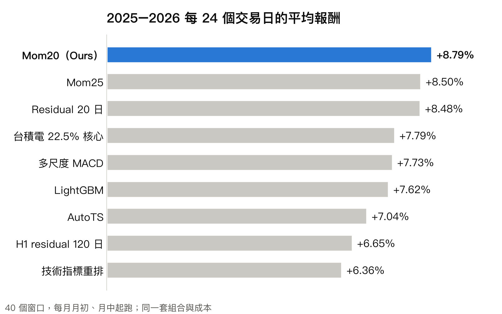

# 玉山 ETF 競賽：每日選股

150 檔挑 25 檔，跑 24 個交易日。

- 目前策略：Mom20
  - 20 日動能前 25 檔等權
  - [策略細節](docs/strategy.md)
- 結果：Mom20 最好
  - 2025–2026 平均 +8.79%
  - 其他方法都沒贏它
  - [全部結果](docs/strategy.md#結果)
- 每日提交：`./run_daily.sh`
  - 05:00–08:55 上傳 D-Plan
  - 首日 10/26，隊號 `TEAM_11076`
  - [怎麼跑](docs/how_to_run.md)
- [比賽規則](docs/task.md)
- [舊研究](legacy/README.md)

[各方法數字](legacy/ml/results/main_table.md)

