# A 策略深入調參｜兩個股票池分開評估

已完成 530 次正式候選回測：每軌 201 組探索與 64 組局部深化。兩軌均通過獨立帳務、選優、設定與來源稽核；這是已觀察開發期間的結果，不能當作未見樣本外驗證。

回測涵蓋 2025-01-02 至 2026-09-21，共 417 個完整交易日，初始本金 10 億元。2026 年 9 月只計至 21 日；研究凍結時 9/22 仍在交易中，因此不混入未完成當日行情。所有主表使用扣成本、含應收股息的 economic NAV。

選擇順序是：全期零已量測硬性違規 → 最高扣成本報酬 → 較低回撤 → 候選 ID。回撤受限版另要求全期 MDD 不高於同軌原 A；strict 版另要求 4H 方向偏多。這些都是全期事後選擇，不是未來風險保證。

Active Share 缺少可驗證的歷史 ETF 持倉，仍為 UNKNOWN／BLOCK_SUBMISSION。零已量測硬性違規不等於正式合規；本報告不解除正式送單限制。

[實驗規格](../docs/a_deep_protocol.md) · [資料與規則限制](../docs/tuning_2nd_data_readiness.md) · [全部候選 CSV](a_deep_tuning_assets/all_trials.csv) · [產物與來源 SHA-256](a_deep_tuning_assets/provenance.json)

## 先分清楚兩個問題

| 路徑 | 成分股資訊 | 可支持的解讀 |
| --- | --- | --- |
| 歷史股票池（重建時點假設） | 固定 2024 年底 150 檔；known-at 為 12/31 19:30 重建假設 | 此假設下的歷史開發回測 |
| 正式名單事後情境（成分股前視） | 使用 2026 年 9 月公布的正式 150 檔，套回 2025 年 | 含成分股前視的事後情境 |

兩軌分開選參，不以兩個股票池的勝負作方法因果比較。交易訊號與固定股數使用當時已完成資料、次日 VWAP 只供成交結算；這項時間順序不會消除全期選參偏誤、歷史資料修訂風險或正式名單的成分股前視。

## 參數清單與實際搜尋範圍

| 參數 | 探索取值 | 局部延伸 | 生效條件 |
| --- | --- | --- | --- |
| 目標持股數 | 20, 22, 25, 28, 30 | 無 | 所有候選 |
| 普通換股分差 | 0, 0.025, 0.05, 0.1, 0.2, 0.3, 0.4 | 無 | 普通換股上限 > 0 |
| 普通換股上限 | 0, 1, 2, 4, 6, 8 | 12 | 所有候選 |
| 波動暴增倍數 | 1.5, 2, 2.5, 3, 4, 5 | 8 | 所有候選 |
| 單日追高上限 | 0.03, 0.04, 0.055, 0.07, 0.085, 0.095 | 無 | 所有候選 |
| 相對量下限 | 0.2, 0.3, 0.5, 0.8, 1 | 無 | 所有候選 |
| 相對量上限 | 2, 3, 5, 8 | 10 | 所有候選 |
| 4H 方向確認 | strict, coverage_only | 無 | 所有候選 |
| 報酬短／長窗口 | 5/20, 10/30, 15/40, 20/50, 30/90, 40/120 | 50/160 | 所有候選 |
| EMA 快／慢窗口 | 5/20, 10/30, 15/40, 20/50, 30/90, 50/150 | 60/180 | 所有候選 |
| MACD 快／慢／訊號 | 6/13/4, 8/21/5, 12/26/9, 16/35/9, 19/39/9, 24/52/12 | 30/65/15 | 所有候選 |
| 動能總權重 m | 0.55, 0.65, 0.75, 0.85, 0.95 | 無 | 所有候選 |
| 長期報酬占動能 q | 0.15, 0.2, 0.35, 0.466667, 0.5, 0.7, 0.85, 0.9 | 無 | 所有候選 |

共 17 個平面設定欄位、13 個搜尋軸。報酬與 EMA 的兩個窗口、MACD 的三個窗口均以成組選项搜尋，沒有窮舉所有整數組合。普通換股上限為 0 時，換股分差不生效，有效維度降為 12 軸；風控退出與現金／權重修正仍可能交易。有效設定已去重，包括浮點數等價評分權重。

m 是動能總權重，q 是長期報酬占動能的比例：短期=m×(1−q)、長期=m×q、量能=(1−m)×0.4，MACD／趨勢／長期趨勢各=(1−m)×0.2。strict 與 coverage_only 使用相同 4H 資料與 50 根棒準備門檻，後者僅移除偏多方向要求；它不是完全不需 4H 資料。

新權重參數化可精確重播原 p052／p049 兩個錨點，但未完整包含舊 slow 與 balanced 評分家族的精確權重；本輪只搜尋宣告的新離散格點。Sobol 是 12 個配套軸，加上第 13 個 4H 成對組別，不能稱為 17 維 Sobol。

固定：20–30 檔、一般股 10%／台積電 25% 上限、現金非負且 <25%、現金 guard 12% 與 headroom 2%、價格預算 0.9／1.1、1,000 股整張、手續費 0.1425%、賣出稅 0.3%。日線長期 EMA100／200、200 日暖機與 4H EMA20／MACD12/26/9 不調整。A 不使用板塊或美股評分權重。

| 路徑 | 階段 | 次數 |
| --- | --- | --- |
| historical_pit | incumbent | 2 |
| historical_pit | local_refinement | 64 |
| historical_pit | ofat | 71 |
| historical_pit | sobol | 128 |
| official_ex_post | incumbent | 2 |
| official_ex_post | local_refinement | 64 |
| official_ex_post | ofat | 71 |
| official_ex_post | sobol | 128 |

探索包含兩軌原 A 設定作錨點、單軸探測及兩個 seed 的配對 Sobol。每軌兩個 seed 各 32 對 strict／coverage_only；局部階段由同一開發期的合格結果挑父組，再調整 1–3 個鄰近軸。局部候選屬自適應事後搜尋，不能拿它們重排較早歷史，宣稱當時已選到。

[17 欄設定與分組軸 CSV](a_deep_tuning_assets/parameter_inventory.csv) · [四個 A 最終版本參數 CSV](a_deep_tuning_assets/selected_parameters.csv)

## 歷史股票池（重建時點假設）

報酬最佳為 a0036：扣成本報酬 200.33%，economic MDD 24.95%。相較同軌原 A，報酬差 +8.12 個百分點、MDD 差 +1.28 個百分點。這是本次有限搜尋中的最佳開發結果。

已獨立重建 265 組候選帳務，其中 178 組全期零已量測硬性違規。最大獨立帳務重建誤差 3.34e-06 元。

實際截斷資料驗證：對本軌報酬最佳 a0036，刪除 2025-12-31 之後的日線與 4H 資料、重建指標並重跑，通過 243 個交易日、1033 筆成交的比較。日期、股票、固定股數與持股數量一致；economic NAV 最大 CSV 數值誤差為 0 元。

這項檢查只支持固定已選設定的交易時序一致性，不代表所有候選都做過實際截斷重跑，也不能證明該最佳設定在截斷當時可知。截斷期末會結算應收股息，因此期末比較 economic NAV；更早的帳面餘額另外核對。全期選參與正式名單前視限制仍在。

按 orders／trades／equity 三份 CSV 的逐位元組雜湊，本軌有 258 組不同的已實現檔案路徑。這個嚴格相等計數不把不同設定自動視為不同交易證據，也不把微小數值差異視為經濟上顯著差異。

| 模型 | 參數 | 扣成本報酬 | 應收 MDD | 帳面 MDD | 硬性違規日 | 雙向換手 | 費稅百萬 | 交易天數 | 成交筆數 |
| --- | --- | --- | --- | --- | --- | --- | --- | --- | --- |
| 報酬最佳 | a0036 | 200.33% | 24.95% | 25.16% | 0 | 25.62× | 109.85 | 416 | 1638 |
| 回撤受限最佳 | a0016 | 196.19% | 23.06% | 23.17% | 0 | 25.53× | 111.85 | 415 | 1492 |
| strict 最佳 | a0139 | 195.05% | 22.32% | 22.42% | 0 | 22.75× | 102.49 | 412 | 1484 |
| 原 A 基準 | a0000 | 192.21% | 23.67% | 23.70% | 0 | 25.15× | 111.82 | 415 | 1566 |
| 固定 v1 | FIXED_BENCHMARK | 173.54% | 19.53% | 19.55% | 9 | 34.20× | 152.18 | 393 | 4340 |
| 0050 | FIXED_BENCHMARK | 121.28% | 24.59% | 25.79% | 不適用 | 0.90× | 1.28 | 1 | 1 |

表中 MDD 均以正數表示損失幅度。0050 是單一 ETF 比較基準，持股檔數等策略競賽規則不適用；固定 v1 沿用舊規劃器，與新 A 的差異混合了規則執行器與額外調參，不能歸因為訊號方法單獨勝出。

| 參數 | 報酬最佳 | 回撤受限最佳 | strict 最佳 | 原 A 基準 |
| --- | --- | --- | --- | --- |
| 目標持股數 | 20 | 20 | 20 | 20 |
| 普通換股分差 | 0 | 0 | 0.1 | 0 |
| 普通換股上限 | 4 | 4 | 1 | 4 |
| 波動暴增倍數 | 3 | 3 | 2.5 | 3 |
| 單日追高上限 | 0.095 | 0.03 | 0.04 | 0.095 |
| 相對量下限 | 0.5 | 0.5 | 0.5 | 0.5 |
| 相對量上限 | 3 | 3 | 3 | 3 |
| 4H 方向確認 | coverage_only | coverage_only | strict | coverage_only |
| 報酬短／長窗口 | 20/50 | 20/50 | 20/50 | 20/50 |
| EMA 快／慢窗口 | 30/90 | 30/90 | 50/150 | 30/90 |
| MACD 快／慢／訊號 | 12/26/9 | 12/26/9 | 24/52/12 | 12/26/9 |
| 動能總權重 m | 0.75 | 0.75 | 0.95 | 0.75 |
| 長期報酬占動能 q | 0.15 | 0.466667 | 0.35 | 0.466667 |

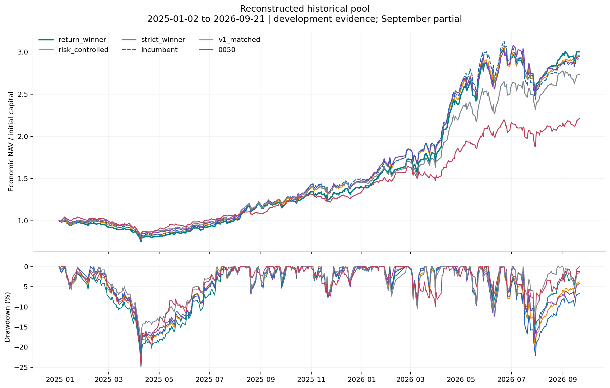

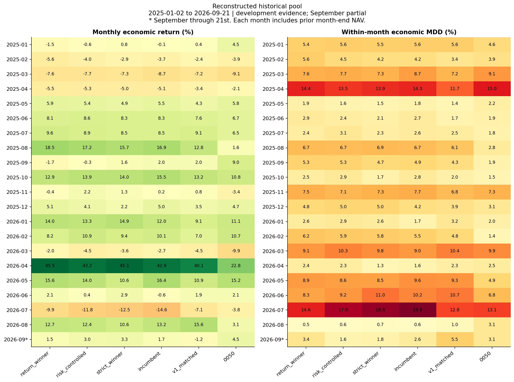

月報酬以前一月底至當月底計；月內 MDD 的高點從前一月底 NAV 開始，不沿用更早的高點。帳面 NAV 在研究期末才收到股息現金，economic NAV 在除息時列入應收；全期末值相同，期中回撤與月報可能不同。本研究沒有每個月重新開帳。

| 模型 | 持股範圍 | 現金比例 | 不可行執行日 | 價格界限警示 | 超過日量10%筆數 | 超過日量100%筆數 |
| --- | --- | --- | --- | --- | --- | --- |
| 報酬最佳 | 20–30 | 1.16%–21.85% | 1 | 0 | 113 | 7 |
| 回撤受限最佳 | 20–30 | 1.02%–21.17% | 2 | 1 | 143 | 13 |
| strict 最佳 | 20–29 | 1.14%–21.08% | 1 | 0 | 113 | 7 |
| 原 A 基準 | 20–30 | 1.14%–20.87% | 2 | 0 | 126 | 6 |
| 固定 v1 | 20–25 | 1.47%–27.44% | 19 | 2 | 137 | 10 |

現金 guard、普通換股、強制修正與股數取整會交互影響結果。不可行規劃／未成交與已實現硬性違規是不同欄位，不能互相抵銷。全額 VWAP 成交、無市場衝擊與價格上下界仍是模擬假設；超過全天成交量的交易無法當作可實際執行的績效。

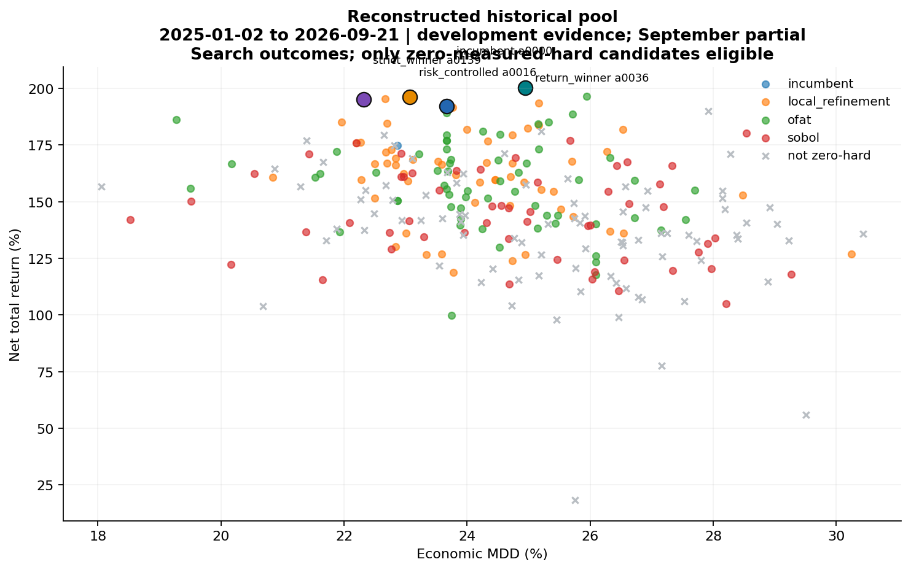

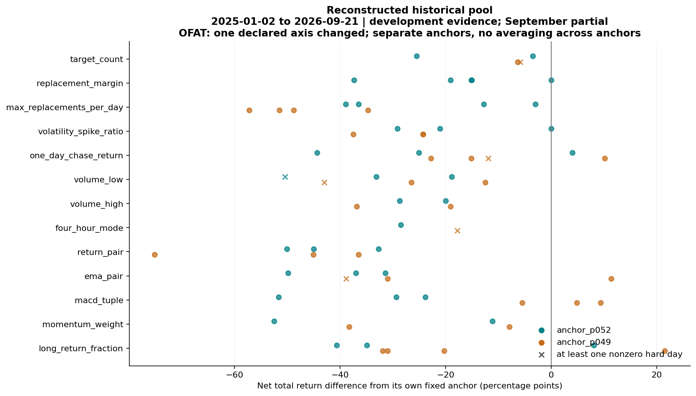

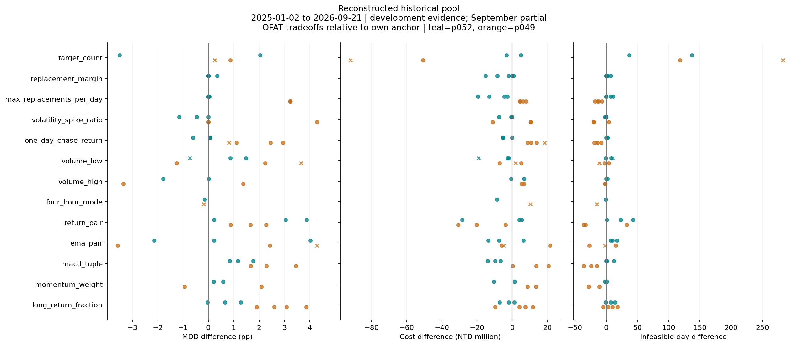

OFAT 每次只改一個宣告軸，回報與自身錨點的差值；不把兩個錨點混成一個平均基準。叉號含不合格候選，用來展示代價，不得列為可選模型。下圖聯合搜尋的分組中位數則有其他參數與自適應挑選混雜，只能描述關聯。

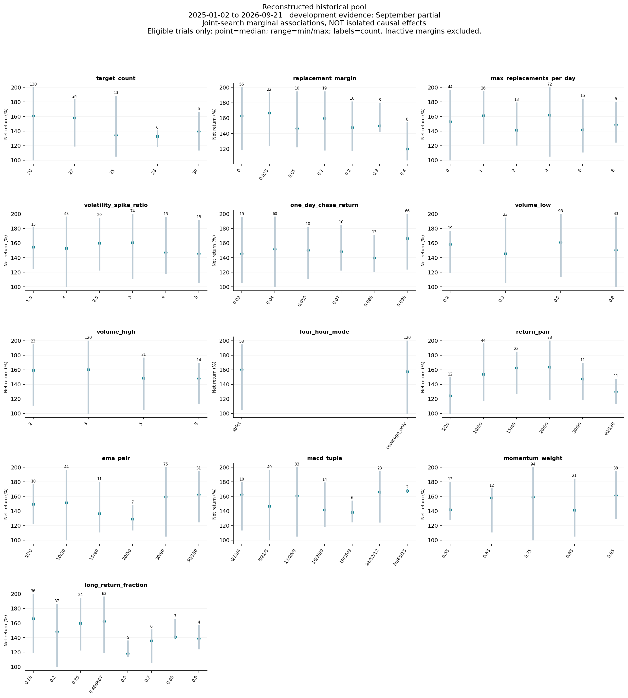

| seed | 範圍 | 對數 | 報酬差中位pp | 回撤差中位pp | coverage報酬較高比例 |
| --- | --- | --- | --- | --- | --- |
| 20260922 | 全部配對 | 32 | +8.46 | +0.73 | 59.38% |
| 20260922 | 兩者均零硬性違規 | 8 | +8.22 | +0.73 | 62.50% |
| 20260923 | 全部配對 | 32 | +4.32 | +0.49 | 59.38% |
| 20260923 | 兩者均零硬性違規 | 13 | -1.97 | +1.37 | 46.15% |

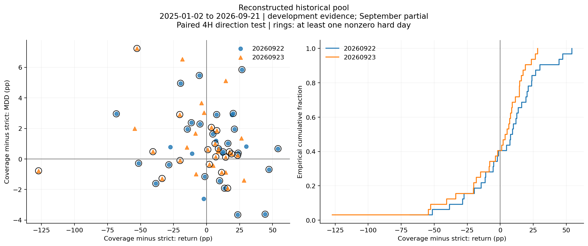

這個配對比較固定其餘設定，因而能辨識本資料／執行器內移除 4H 方向門檻的效果。全部配對與雙方合格子集同時列出，避免隱藏規則失敗；雙方合格子集仍是條件化分析。兩個 seed 是搜尋設計差異，不是同一市場的兩次獨立抽樣。

| seed | 4H範圍 | 次數 | 合格數 | 最佳 | 報酬 | MDD |
| --- | --- | --- | --- | --- | --- | --- |
| 20260922 | all | 64 | 24 | a0114 | 180.15% | 28.54% |
| 20260922 | strict | 32 | 13 | a0111 | 169.49% | 24.79% |
| 20260922 | coverage_only | 32 | 11 | a0114 | 180.15% | 28.54% |
| 20260923 | all | 64 | 31 | a0139 | 195.05% | 22.32% |
| 20260923 | strict | 32 | 16 | a0139 | 195.05% | 22.32% |
| 20260923 | coverage_only | 32 | 15 | a0150 | 176.97% | 25.67% |

| 模型 | 參數 | 邊界軸 | 值 | 位置 | 下界 | 上界 |
| --- | --- | --- | --- | --- | --- | --- |
| return_winner | a0036 | target_count | 20 | LOWER | 20 | 30 |
| return_winner | a0036 | replacement_margin | 0 | LOWER | 0 | 0.4 |
| return_winner | a0036 | one_day_chase_return | 0.095 | UPPER | 0.03 | 0.095 |
| return_winner | a0036 | long_return_fraction | 0.15 | LOWER | 0.15 | 0.9 |
| risk_controlled | a0016 | target_count | 20 | LOWER | 20 | 30 |
| risk_controlled | a0016 | replacement_margin | 0 | LOWER | 0 | 0.4 |
| risk_controlled | a0016 | one_day_chase_return | 0.03 | LOWER | 0.03 | 0.095 |
| strict_winner | a0139 | target_count | 20 | LOWER | 20 | 30 |
| strict_winner | a0139 | momentum_weight | 0.95 | UPPER | 0.55 | 0.95 |
| incumbent | a0000 | target_count | 20 | LOWER | 20 | 30 |
| incumbent | a0000 | replacement_margin | 0 | LOWER | 0 | 0.4 |
| incumbent | a0000 | one_day_chase_return | 0.095 | UPPER | 0.03 | 0.095 |

邊界表使用預先宣告的探索加局部延伸範圍；組合窗口按宣告順序排列，4H 類別不算數值邊界。選中邊界只代表尚不能排除更外側設定更好，不能當成全域最佳或任意擴大搜尋的理由；完整 CSV 亦記錄哪些宣告端點實際未被抽到。

| 開發段 | 模型 | 交易日 | 段報酬 | 段內MDD |
| --- | --- | --- | --- | --- |
| 2025H1 | return_winner | 116 | -6.96% | 24.95% |
| 2025H2 | return_winner | 127 | 50.95% | 7.54% |
| 2026H1 | return_winner | 116 | 107.61% | 9.14% |
| 2026Q3_partial | return_winner | 58 | 3.00% | 14.58% |
| 2025H1 | risk_controlled | 116 | -4.35% | 23.06% |
| 2025H2 | risk_controlled | 127 | 54.23% | 7.05% |
| 2026H1 | risk_controlled | 116 | 96.79% | 10.28% |
| 2026Q3_partial | risk_controlled | 58 | 2.03% | 17.92% |
| 2025H1 | strict_winner | 116 | -2.22% | 22.32% |
| 2025H2 | strict_winner | 127 | 50.63% | 7.34% |
| 2026H1 | strict_winner | 116 | 100.31% | 12.40% |
| 2026Q3_partial | strict_winner | 58 | 0.01% | 18.84% |
| 2025H1 | incumbent | 116 | -4.68% | 23.67% |
| 2025H2 | incumbent | 127 | 57.16% | 7.72% |
| 2026H1 | incumbent | 116 | 98.52% | 10.18% |
| 2026Q3_partial | incumbent | 58 | -1.74% | 19.77% |
| 2025H1 | v1_matched | 116 | -1.41% | 19.53% |
| 2025H2 | v1_matched | 127 | 48.21% | 6.81% |
| 2026H1 | v1_matched | 116 | 76.45% | 11.70% |
| 2026Q3_partial | v1_matched | 58 | 6.10% | 12.76% |
| 2025H1 | 0050 | 116 | 0.81% | 24.59% |
| 2025H2 | 0050 | 127 | 32.38% | 7.31% |
| 2026H1 | 0050 | 116 | 60.04% | 9.94% |
| 2026Q3_partial | 0050 | 58 | 3.60% | 13.07% |

分段是同一連續持倉帳本的切片，每段起點用前一日 NAV，沒有重新初始化持股。這些日期都已參與選參，只能檢查表現是否集中於少數開發段，不能重新命名為樣本外或未見驗證。

| 模型 | 每日平均超額bp | 條件式95%區間bp | 重抽樣差值>0比例 |
| --- | --- | --- | --- |
| 報酬最佳 | +0.589 | [-3.272, +4.577] | 62.30% |
| 回撤受限最佳 | +0.348 | [-2.154, +3.138] | 60.50% |
| strict 最佳 | +0.224 | [-4.231, +5.500] | 52.50% |

上述為相對同軌原 A 的配對 circular moving-block bootstrap：20 交易日區塊、1,000 次、固定 seed 20260922，重抽每日報酬差；bp=0.01 個百分點。它只量化已選曲線在此重抽樣規則下的不確定性，沒有重跑交易或重新選參，沒有校正多次搜尋與事後選擇偏誤。正值比例不是 p 值；區間不代表未來報酬區間，也不證明顯著優勢。

[獨立帳務／來源稽核](../outputs/a_deep_tuning/historical_pit/audit.json) · [凍結執行清單](../outputs/a_deep_tuning/historical_pit/manifest.json) · [實際截斷資料驗證](../outputs/a_deep_tuning/historical_pit/physical_prefix_audit.json) · [事後選擇紀錄](../outputs/a_deep_tuning/historical_pit/selection.json) · [全期月表 CSV](a_deep_tuning_assets/monthly.csv) · [單軸 CSV](a_deep_tuning_assets/ofat_effects.csv) · [配對 4H CSV](a_deep_tuning_assets/paired_4h.csv)

## 正式名單事後情境（成分股前視）

報酬最佳為 r0050：扣成本報酬 360.04%，economic MDD 23.69%。相較同軌原 A，報酬差 +82.53 個百分點、MDD 差 -1.67 個百分點。這是本次有限搜尋中的最佳開發結果。

已獨立重建 265 組候選帳務，其中 164 組全期零已量測硬性違規。最大獨立帳務重建誤差 3.34e-06 元。

實際截斷資料驗證：對本軌報酬最佳 r0050，刪除 2026-06-30 之後的日線與 4H 資料、重建指標並重跑，通過 359 個交易日、1470 筆成交的比較。日期、股票、固定股數與持股數量一致；economic NAV 最大 CSV 數值誤差為 0 元。

正式名單軌採 2026-06-30 截斷，因完整 150 檔中最晚上市者在 2026 年 4 月才出現；這保留原引擎的全名單歷史資料存在檢查。未把該軌縮成較少股票，也沒有宣稱它通過 2025 年底截斷。

這項檢查只支持固定已選設定的交易時序一致性，不代表所有候選都做過實際截斷重跑，也不能證明該最佳設定在截斷當時可知。截斷期末會結算應收股息，因此期末比較 economic NAV；更早的帳面餘額另外核對。全期選參與正式名單前視限制仍在。

按 orders／trades／equity 三份 CSV 的逐位元組雜湊，本軌有 256 組不同的已實現檔案路徑。這個嚴格相等計數不把不同設定自動視為不同交易證據，也不把微小數值差異視為經濟上顯著差異。

| 模型 | 參數 | 扣成本報酬 | 應收 MDD | 帳面 MDD | 硬性違規日 | 雙向換手 | 費稅百萬 | 交易天數 | 成交筆數 |
| --- | --- | --- | --- | --- | --- | --- | --- | --- | --- |
| 報酬最佳 | r0050 | 360.04% | 23.69% | 23.72% | 0 | 26.03× | 163.87 | 385 | 1697 |
| 回撤受限最佳 | r0050 | 360.04% | 23.69% | 23.72% | 0 | 26.03× | 163.87 | 385 | 1697 |
| strict 最佳 | r0050 | 360.04% | 23.69% | 23.72% | 0 | 26.03× | 163.87 | 385 | 1697 |
| 原 A 基準 | a0001 | 277.51% | 25.36% | 25.39% | 0 | 24.77× | 141.09 | 359 | 1606 |
| 固定 v1 | FIXED_BENCHMARK | 248.15% | 21.80% | 21.81% | 7 | 36.07× | 195.35 | 405 | 4776 |
| 0050 | FIXED_BENCHMARK | 121.28% | 24.59% | 25.79% | 不適用 | 0.90× | 1.28 | 1 | 1 |

表中 MDD 均以正數表示損失幅度。0050 是單一 ETF 比較基準，持股檔數等策略競賽規則不適用；固定 v1 沿用舊規劃器，與新 A 的差異混合了規則執行器與額外調參，不能歸因為訊號方法單獨勝出。

| 參數 | 報酬最佳 | 回撤受限最佳 | strict 最佳 | 原 A 基準 |
| --- | --- | --- | --- | --- |
| 目標持股數 | 20 | 20 | 20 | 20 |
| 普通換股分差 | 0.05 | 0.05 | 0.05 | 0.2 |
| 普通換股上限 | 1 | 1 | 1 | 0 |
| 波動暴增倍數 | 2.5 | 2.5 | 2.5 | 2 |
| 單日追高上限 | 0.07 | 0.07 | 0.07 | 0.04 |
| 相對量下限 | 0.3 | 0.3 | 0.3 | 0.8 |
| 相對量上限 | 5 | 5 | 5 | 3 |
| 4H 方向確認 | strict | strict | strict | coverage_only |
| 報酬短／長窗口 | 10/30 | 10/30 | 10/30 | 10/30 |
| EMA 快／慢窗口 | 5/20 | 5/20 | 5/20 | 10/30 |
| MACD 快／慢／訊號 | 12/26/9 | 12/26/9 | 12/26/9 | 8/21/5 |
| 動能總權重 m | 0.65 | 0.65 | 0.65 | 0.75 |
| 長期報酬占動能 q | 0.35 | 0.35 | 0.35 | 0.2 |

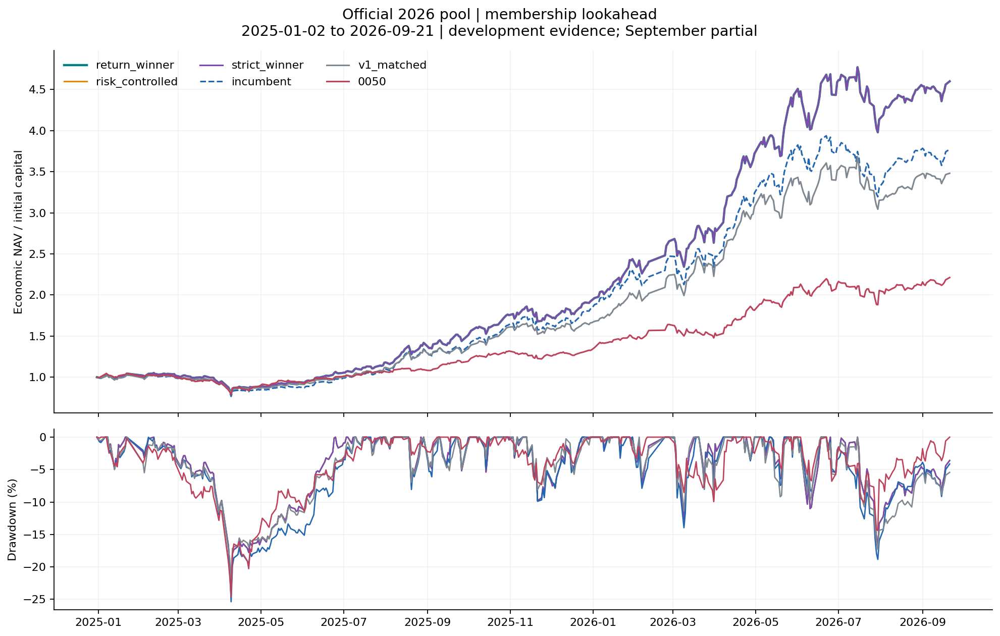

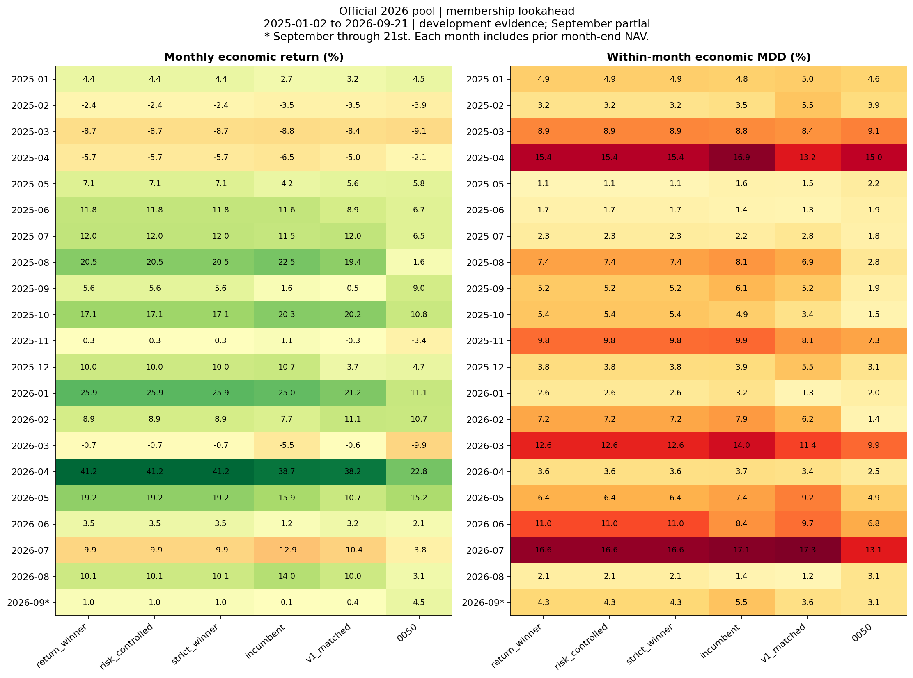

月報酬以前一月底至當月底計；月內 MDD 的高點從前一月底 NAV 開始，不沿用更早的高點。帳面 NAV 在研究期末才收到股息現金，economic NAV 在除息時列入應收；全期末值相同，期中回撤與月報可能不同。本研究沒有每個月重新開帳。

| 模型 | 持股範圍 | 現金比例 | 不可行執行日 | 價格界限警示 | 超過日量10%筆數 | 超過日量100%筆數 |
| --- | --- | --- | --- | --- | --- | --- |
| 報酬最佳 | 20–30 | 3.57%–21.20% | 31 | 2 | 147 | 18 |
| 回撤受限最佳 | 20–30 | 3.57%–21.20% | 31 | 2 | 147 | 18 |
| strict 最佳 | 20–30 | 3.57%–21.20% | 31 | 2 | 147 | 18 |
| 原 A 基準 | 20–30 | 1.19%–23.05% | 49 | 1 | 113 | 16 |
| 固定 v1 | 21–25 | 1.53%–26.45% | 11 | 2 | 153 | 10 |

現金 guard、普通換股、強制修正與股數取整會交互影響結果。不可行規劃／未成交與已實現硬性違規是不同欄位，不能互相抵銷。全額 VWAP 成交、無市場衝擊與價格上下界仍是模擬假設；超過全天成交量的交易無法當作可實際執行的績效。

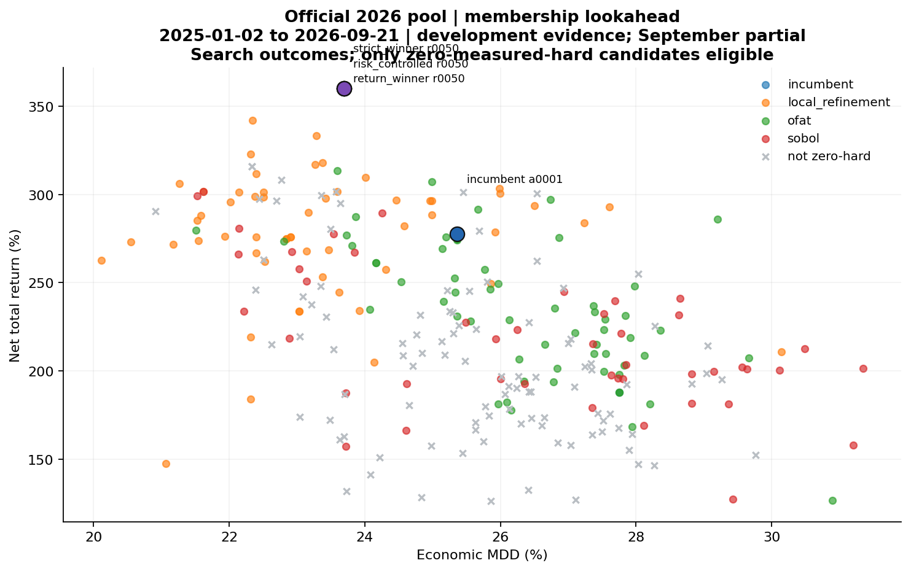

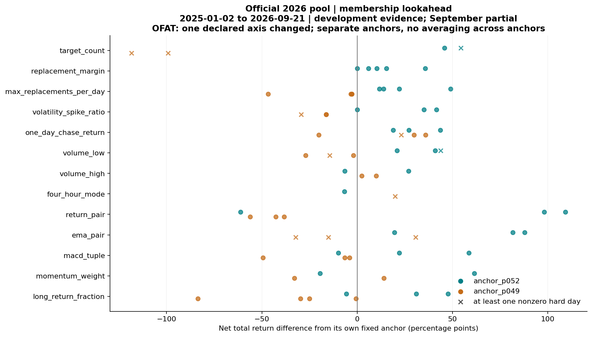

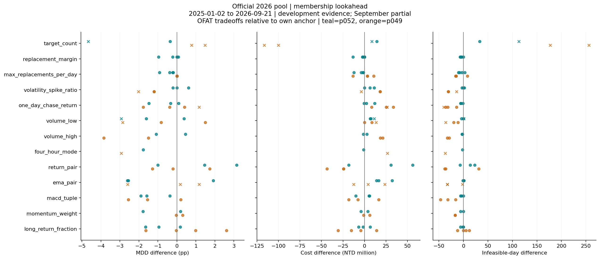

OFAT 每次只改一個宣告軸，回報與自身錨點的差值；不把兩個錨點混成一個平均基準。叉號含不合格候選，用來展示代價，不得列為可選模型。下圖聯合搜尋的分組中位數則有其他參數與自適應挑選混雜，只能描述關聯。

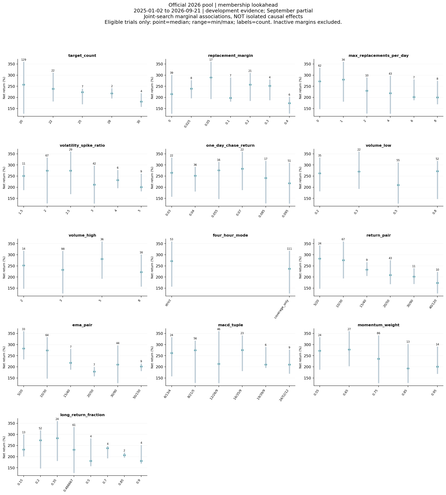

| seed | 範圍 | 對數 | 報酬差中位pp | 回撤差中位pp | coverage報酬較高比例 |
| --- | --- | --- | --- | --- | --- |
| 20260922 | 全部配對 | 32 | +7.61 | +1.40 | 53.12% |
| 20260922 | 兩者均零硬性違規 | 9 | -10.12 | +0.85 | 33.33% |
| 20260923 | 全部配對 | 32 | -4.88 | +0.90 | 31.25% |
| 20260923 | 兩者均零硬性違規 | 9 | -16.40 | +1.10 | 22.22% |

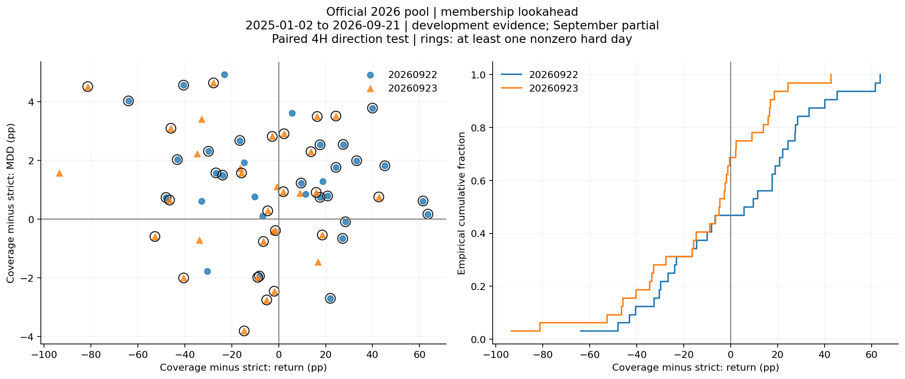

這個配對比較固定其餘設定，因而能辨識本資料／執行器內移除 4H 方向門檻的效果。全部配對與雙方合格子集同時列出，避免隱藏規則失敗；雙方合格子集仍是條件化分析。兩個 seed 是搜尋設計差異，不是同一市場的兩次獨立抽樣。

| seed | 4H範圍 | 次數 | 合格數 | 最佳 | 報酬 | MDD |
| --- | --- | --- | --- | --- | --- | --- |
| 20260922 | all | 64 | 22 | a0119 | 299.00% | 21.52% |
| 20260922 | strict | 32 | 11 | a0119 | 299.00% | 21.52% |
| 20260922 | coverage_only | 32 | 11 | a0120 | 266.23% | 22.14% |
| 20260923 | all | 64 | 23 | a0149 | 301.73% | 21.62% |
| 20260923 | strict | 32 | 11 | a0149 | 301.73% | 21.62% |
| 20260923 | coverage_only | 32 | 12 | a0150 | 267.05% | 23.85% |

| 模型 | 參數 | 邊界軸 | 值 | 位置 | 下界 | 上界 |
| --- | --- | --- | --- | --- | --- | --- |
| return_winner | r0050 | target_count | 20 | LOWER | 20 | 30 |
| return_winner | r0050 | ema_pair | 5/20 | LOWER | 5/20 | 60/180 |
| risk_controlled | r0050 | target_count | 20 | LOWER | 20 | 30 |
| risk_controlled | r0050 | ema_pair | 5/20 | LOWER | 5/20 | 60/180 |
| strict_winner | r0050 | target_count | 20 | LOWER | 20 | 30 |
| strict_winner | r0050 | ema_pair | 5/20 | LOWER | 5/20 | 60/180 |
| incumbent | a0001 | target_count | 20 | LOWER | 20 | 30 |
| incumbent | a0001 | max_replacements_per_day | 0 | LOWER | 0 | 12 |

邊界表使用預先宣告的探索加局部延伸範圍；組合窗口按宣告順序排列，4H 類別不算數值邊界。選中邊界只代表尚不能排除更外側設定更好，不能當成全域最佳或任意擴大搜尋的理由；完整 CSV 亦記錄哪些宣告端點實際未被抽到。

| 開發段 | 模型 | 交易日 | 段報酬 | 段內MDD |
| --- | --- | --- | --- | --- |
| 2025H1 | return_winner | 116 | 5.11% | 23.69% |
| 2025H2 | return_winner | 127 | 84.15% | 9.78% |
| 2026H1 | return_winner | 116 | 137.19% | 12.63% |
| 2026Q3_partial | return_winner | 58 | 0.20% | 16.61% |
| 2025H1 | risk_controlled | 116 | 5.11% | 23.69% |
| 2025H2 | risk_controlled | 127 | 84.15% | 9.78% |
| 2026H1 | risk_controlled | 116 | 137.19% | 12.63% |
| 2026Q3_partial | risk_controlled | 58 | 0.20% | 16.61% |
| 2025H1 | strict_winner | 116 | 5.11% | 23.69% |
| 2025H2 | strict_winner | 127 | 84.15% | 9.78% |
| 2026H1 | strict_winner | 116 | 137.19% | 12.63% |
| 2026Q3_partial | strict_winner | 58 | 0.20% | 16.61% |
| 2025H1 | incumbent | 116 | -1.67% | 25.36% |
| 2025H2 | incumbent | 127 | 86.89% | 9.89% |
| 2026H1 | incumbent | 116 | 106.77% | 13.96% |
| 2026Q3_partial | incumbent | 58 | -0.65% | 17.06% |
| 2025H1 | v1_matched | 116 | -0.29% | 21.80% |
| 2025H2 | v1_matched | 127 | 66.85% | 8.09% |
| 2026H1 | v1_matched | 116 | 111.51% | 11.38% |
| 2026Q3_partial | v1_matched | 58 | -1.06% | 17.34% |
| 2025H1 | 0050 | 116 | 0.81% | 24.59% |
| 2025H2 | 0050 | 127 | 32.38% | 7.31% |
| 2026H1 | 0050 | 116 | 60.04% | 9.94% |
| 2026Q3_partial | 0050 | 58 | 3.60% | 13.07% |

分段是同一連續持倉帳本的切片，每段起點用前一日 NAV，沒有重新初始化持股。這些日期都已參與選參，只能檢查表現是否集中於少數開發段，不能重新命名為樣本外或未見驗證。

| 模型 | 每日平均超額bp | 條件式95%區間bp | 重抽樣差值>0比例 |
| --- | --- | --- | --- |
| 報酬最佳 | +4.773 | [-0.469, +9.698] | 96.20% |
| 回撤受限最佳 | +4.773 | [-0.469, +9.698] | 96.20% |
| strict 最佳 | +4.773 | [-0.469, +9.698] | 96.20% |

上述為相對同軌原 A 的配對 circular moving-block bootstrap：20 交易日區塊、1,000 次、固定 seed 20260922，重抽每日報酬差；bp=0.01 個百分點。它只量化已選曲線在此重抽樣規則下的不確定性，沒有重跑交易或重新選參，沒有校正多次搜尋與事後選擇偏誤。正值比例不是 p 值；區間不代表未來報酬區間，也不證明顯著優勢。

[獨立帳務／來源稽核](../outputs/a_deep_tuning/official_ex_post/audit.json) · [凍結執行清單](../outputs/a_deep_tuning/official_ex_post/manifest.json) · [實際截斷資料驗證](../outputs/a_deep_tuning/official_ex_post/physical_prefix_audit.json) · [事後選擇紀錄](../outputs/a_deep_tuning/official_ex_post/selection.json) · [全期月表 CSV](a_deep_tuning_assets/monthly.csv) · [單軸 CSV](a_deep_tuning_assets/ofat_effects.csv) · [配對 4H CSV](a_deep_tuning_assets/paired_4h.csv)

## 全部候選與可追溯性

HTML 下方提供 530 筆候選的搜尋、股票池／階段／4H／合格條件篩選及點擊欄名排序。每筆保留完整 17 欄參數、父組、seed、規則結果、成本與交易量；CSV 保留全部原始摘要欄位。候選不因違規或績效不佳而從表中消失。

[完整候選 CSV](a_deep_tuning_assets/all_trials.csv) · [六方比較 CSV](a_deep_tuning_assets/comparison.csv) · [21 月完整表](a_deep_tuning_assets/monthly.csv) · [開發分段 CSV](a_deep_tuning_assets/period_robustness.csv) · [各軸關聯 CSV](a_deep_tuning_assets/axis_sensitivity.csv) · [各 seed 最佳 CSV](a_deep_tuning_assets/seed_best.csv) · [邊界 CSV](a_deep_tuning_assets/boundary_checks.csv) · [區塊抽樣 CSV](a_deep_tuning_assets/bootstrap.csv)

## 哪些結論仍不能成立

本輪只支持「在固定資料與規劃器、有限宣告搜尋中，這些候選的開發結果與已量測規則通過獨立重建」。它不支持正式參賽合規、可實盤複製、未來超額報酬、全域最佳或 A 方法必然優於 v1。反覆使用同一段歷史增加選擇偏誤；下一次有資訊價值的檢驗應保留未參與此次開發的新資料及固定採用規則。

本輪採用 Tuning Playbook 的變數分類、配對搜尋預算、單軸診斷與邊界檢查原則；該原則是實驗設計參考，不是台股交易有效性的證據。

[Google Research Tuning Playbook](https://github.com/google-research/tuning_playbook) · [參數與研究限制稽核](../docs/a_deep_parameter_audit.md) · [公開固定策略入口](../v2_A_deep_best.py) · [腳本](../scripts/report_a_deep.py)
