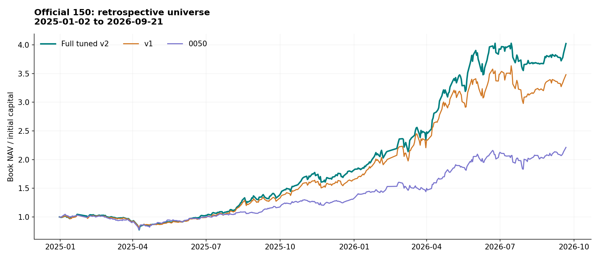
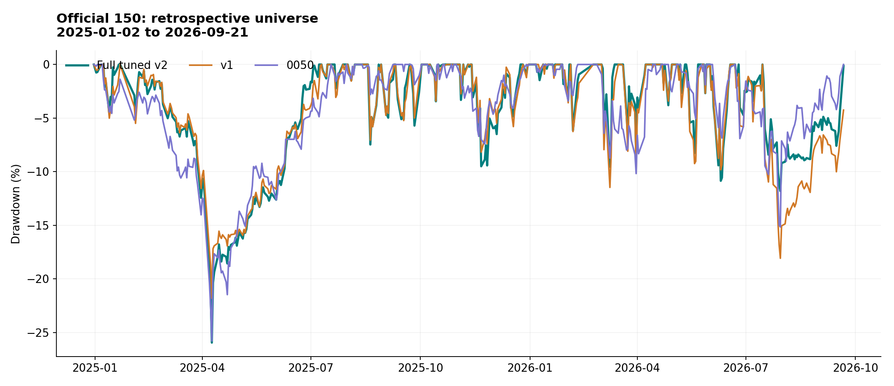
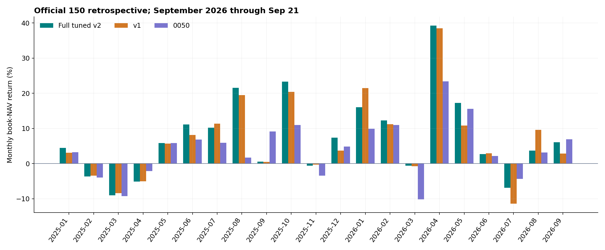
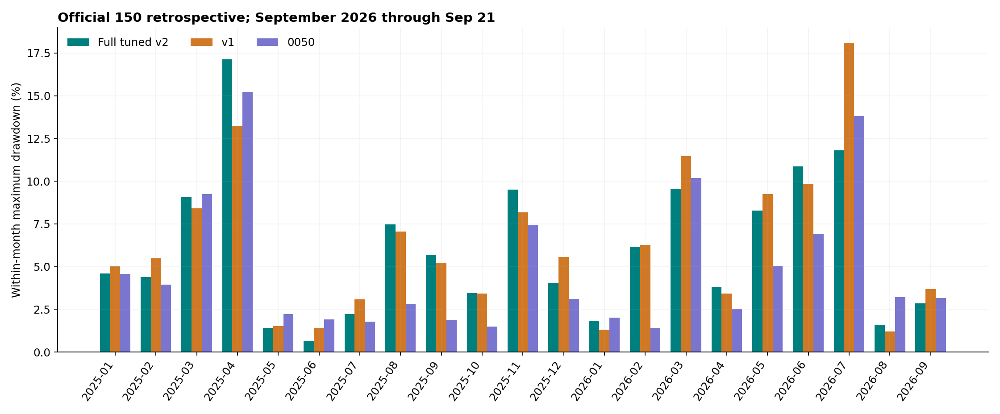
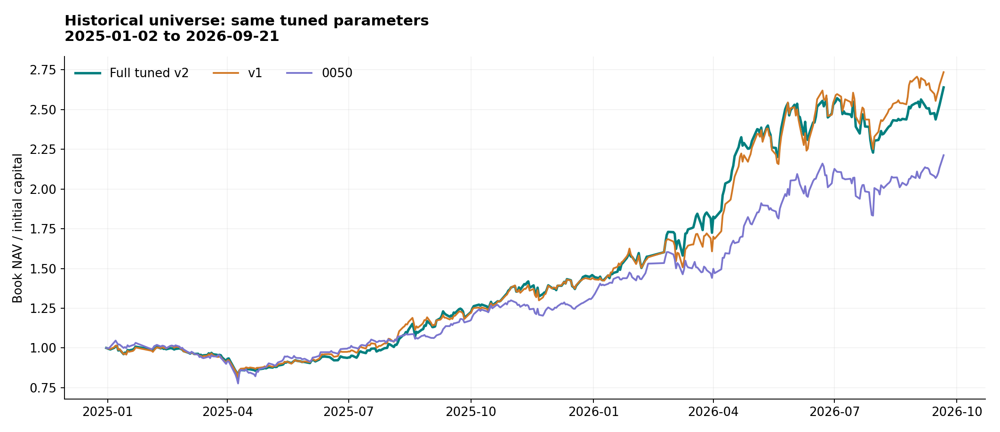
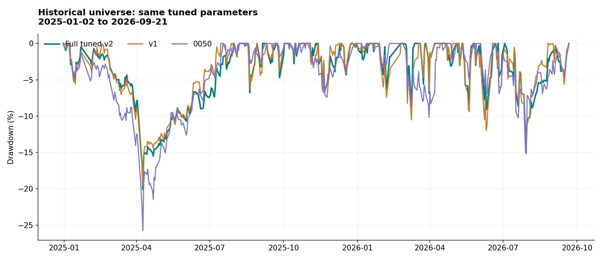
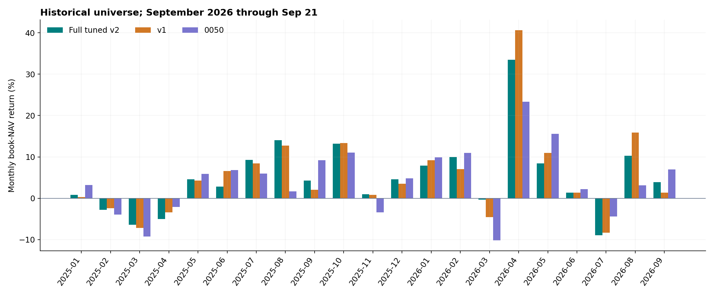
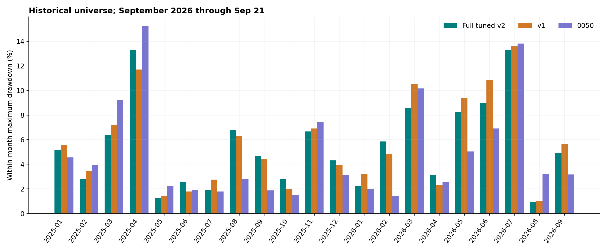
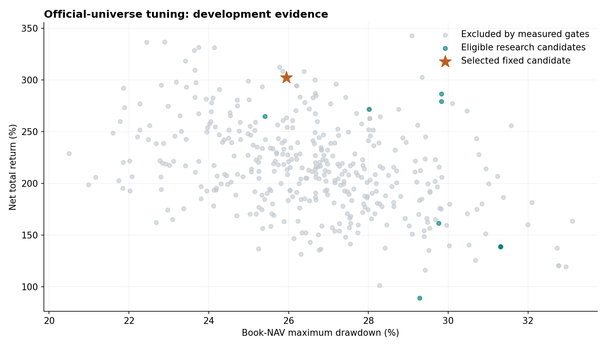

# Full tuned v2：策略、調參與最終比較

**本輪固定候選：f0019。正式 150 檔事後模擬淨報酬 302.35%，最大回撤 25.95%。**

同參數在歷史股票池的報酬為 **163.94%**，回撤 **20.10%**；v1 對照為 173.54%／19.55%。請同時閱讀兩軌，不能只取正式事後池的高數字。v1 的已量測違規另列於表中。

期間為 2025-01-02 至 2026-09-21，共 417 個交易日。初始本金 10 億元，前日訊號決定股數，次日以官方成交均價撮合，已扣手續費與證交稅。

**研究稽核通過，正式送件仍受證據門檻阻擋。** 本輪沒有取得平台成功回執，也沒有把缺少的 Active Share 算法、歷史 ETF 權重與除權訂單語意當成已確認。這份報告不宣稱未來每筆成交必然合規。

[固定策略程式](../v2_offcial_best_deep_tuning.py)　[策略簡報](full_tuned_v2_deck/full_tuned_v2_strategy.pptx)　[每日流程](../daily_auto/full_tuned_workflow.md)　[全部 810 次結果](../outputs/full_tuned_v2/trials.csv)　[逐月數據](../outputs/full_tuned_v2/monthly.csv)　[獨立稽核](../outputs/full_tuned_v2/audit.json)

## 讀數字前的三個口徑

主圖與主表採帳面 NAV。現金股利在期末一次加入，會使最後一個月帳面報酬跳升；CSV 另外列經濟 NAV 月報酬與回撤。9 月只到 21 日，不是完整月份。

月回撤由上月底 NAV 加上當月每日 NAV 計算；全期最大回撤則沿用全期最高點，兩者不能混用。

0050 是同本金、同費稅及價格預算的一次買入版本，初始預留現金，並非百分之百投資的官方總報酬指數。v1 未得到本輪相同調參預算，因此這裡只比較交付版本的結果。

## 正式 150 檔事後模擬

| 策略 | 總報酬 | 最大回撤 | 換手倍數 | 交易筆數 | 費稅／百萬元 | 已量測超限日 |
| --- | --- | --- | --- | --- | --- | --- |
| Full tuned v2 | 302.35% | 25.95% | 25.88× | 1675 | 144.90 | 0 |
| v1 | 248.15% | 21.81% | 36.07× | 4776 | 195.35 | 7 |
| 0050 | 121.28% | 25.79% | 0.90× | 1 | 1.28 | 不適用 |

此池符合現在的競賽白名單，但其歷史成分來自 2026 年名單，不能解讀成 2025 年已知股票池。v1 有已量測違規，0050 也不是合規競賽組合；兩者只作固定研究對照。

展開全部月份：報酬與回撤

| 月份 | Full tuned v2 報酬 | Full tuned v2 回撤 | v1 報酬 | v1 回撤 | 0050 報酬 | 0050 回撤 |
| --- | --- | --- | --- | --- | --- | --- |
| 2025-01 | 4.49% | 4.61% | 3.10% | 5.01% | 3.21% | 4.56% |
| 2025-02 | -3.70% | 4.38% | -3.47% | 5.49% | -3.95% | 3.95% |
| 2025-03 | -9.07% | 9.07% | -8.40% | 8.40% | -9.24% | 9.24% |
| 2025-04 | -5.10% | 17.12% | -5.04% | 13.23% | -2.14% | 15.23% |
| 2025-05 | 5.86% | 1.41% | 5.65% | 1.51% | 5.87% | 2.22% |
| 2025-06 | 11.09% | 0.67% | 8.10% | 1.41% | 6.81% | 1.92% |
| 2025-07 | 10.19% | 2.23% | 11.37% | 3.07% | 5.94% | 1.78% |
| 2025-08 | 21.55% | 7.47% | 19.52% | 7.06% | 1.67% | 2.81% |
| 2025-09 | 0.56% | 5.70% | 0.46% | 5.23% | 9.17% | 1.88% |
| 2025-10 | 23.29% | 3.44% | 20.44% | 3.41% | 11.01% | 1.49% |
| 2025-11 | -0.58% | 9.50% | -0.31% | 8.17% | -3.43% | 7.42% |
| 2025-12 | 7.39% | 4.04% | 3.72% | 5.55% | 4.80% | 3.10% |
| 2026-01 | 16.03% | 1.84% | 21.45% | 1.30% | 9.87% | 2.01% |
| 2026-02 | 12.31% | 6.16% | 11.19% | 6.26% | 10.97% | 1.41% |
| 2026-03 | -0.60% | 9.55% | -0.73% | 11.47% | -10.18% | 10.18% |
| 2026-04 | 39.25% | 3.80% | 38.49% | 3.42% | 23.37% | 2.54% |
| 2026-05 | 17.23% | 8.27% | 10.82% | 9.24% | 15.55% | 5.05% |
| 2026-06 | 2.67% | 10.85% | 2.93% | 9.83% | 2.17% | 6.91% |
| 2026-07 | -6.92% | 11.81% | -11.42% | 18.08% | -4.38% | 13.82% |
| 2026-08 | 3.69% | 1.60% | 9.56% | 1.19% | 3.14% | 3.21% |
| 2026-09 | 6.07% | 2.85% | 2.88% | 3.68% | 6.93% | 3.17% |

## 歷史股票池敏感度

| 策略 | 總報酬 | 最大回撤 | 換手倍數 | 交易筆數 | 費稅／百萬元 | 已量測超限日 |
| --- | --- | --- | --- | --- | --- | --- |
| Full tuned v2 | 163.94% | 20.10% | 29.05× | 1787 | 122.73 | 0 |
| v1 | 173.54% | 19.55% | 34.20× | 4340 | 152.18 | 9 |
| 0050 | 121.28% | 25.79% | 0.90× | 1 | 1.28 | 不適用 |

這一軌使用同一組獲選參數，沒有重新挑冠軍。股票池以 2024 年底可重建資訊為準，但參數仍用已見期間開發，因此也不是未見測試。

展開全部月份：報酬與回撤

| 月份 | Full tuned v2 報酬 | Full tuned v2 回撤 | v1 報酬 | v1 回撤 | 0050 報酬 | 0050 回撤 |
| --- | --- | --- | --- | --- | --- | --- |
| 2025-01 | 0.84% | 5.18% | 0.31% | 5.57% | 3.21% | 4.56% |
| 2025-02 | -2.79% | 2.79% | -2.42% | 3.44% | -3.95% | 3.95% |
| 2025-03 | -6.38% | 6.38% | -7.17% | 7.17% | -9.24% | 9.24% |
| 2025-04 | -5.02% | 13.31% | -3.38% | 11.71% | -2.14% | 15.23% |
| 2025-05 | 4.58% | 1.25% | 4.27% | 1.39% | 5.87% | 2.22% |
| 2025-06 | 2.84% | 2.54% | 6.56% | 1.79% | 6.81% | 1.92% |
| 2025-07 | 9.29% | 1.93% | 8.47% | 2.76% | 5.94% | 1.78% |
| 2025-08 | 14.08% | 6.78% | 12.76% | 6.31% | 1.67% | 2.81% |
| 2025-09 | 4.30% | 4.70% | 2.02% | 4.41% | 9.17% | 1.88% |
| 2025-10 | 13.22% | 2.78% | 13.39% | 2.01% | 11.01% | 1.49% |
| 2025-11 | 0.99% | 6.67% | 0.84% | 6.91% | -3.43% | 7.42% |
| 2025-12 | 4.62% | 4.31% | 3.51% | 3.97% | 4.80% | 3.10% |
| 2026-01 | 7.87% | 2.25% | 9.24% | 3.20% | 9.87% | 2.01% |
| 2026-02 | 9.98% | 5.85% | 7.07% | 4.87% | 10.97% | 1.41% |
| 2026-03 | -0.31% | 8.61% | -4.56% | 10.51% | -10.18% | 10.18% |
| 2026-04 | 33.46% | 3.11% | 40.63% | 2.34% | 23.37% | 2.54% |
| 2026-05 | 8.40% | 8.28% | 10.94% | 9.39% | 15.55% | 5.05% |
| 2026-06 | 1.39% | 8.99% | 1.35% | 10.88% | 2.17% | 6.91% |
| 2026-07 | -8.93% | 13.32% | -8.35% | 13.62% | -4.38% | 13.82% |
| 2026-08 | 10.27% | 0.90% | 15.88% | 1.02% | 3.14% | 3.21% |
| 2026-09 | 3.88% | 4.91% | 1.32% | 5.62% | 6.93% | 3.17% |

## 本輪調參完成度

| 股票池 | 完成 | 通過研究門檻 |
| --- | --- | --- |
| 正式 150 檔事後模擬 | 405 | 11 |
| 歷史股票池敏感度 | 405 | 148 |

341 組探索加 64 組局部深化，兩池共 810 次。搜尋涵蓋 18 個設定、兩個 Sobol seed 與配對 4H 模式。這是明確範圍內的有界搜尋，不能稱全域最優。

先排除已量測硬超限、無有效方案或未成交的候選，再以正式池帳面淨報酬排序，以回撤及換手率破同分。歷史池全程使用同參數，沒有另挑最高收益。所有歷史都已參與開發，搜尋 seed 不是獨立市場樣本。

全部 11 個合格候選

| candidate_id | phase | total_return | max_drawdown | turnover_two_way | no_valid_plan_days | hold_without_envelope_days | four_hour_mode |
| --- | --- | --- | --- | --- | --- | --- | --- |
| f0019 | ofat | 302.35% | 25.95% | 25.88× | 0 | 0 | coverage_only |
| l0055 | local | 302.35% | 25.95% | 25.88× | 0 | 0 | coverage_only |
| f0034 | ofat | 286.50% | 29.83% | 24.94× | 0 | 0 | coverage_only |
| l0035 | local | 279.23% | 29.83% | 24.74× | 0 | 0 | coverage_only |
| l0017 | local | 271.68% | 28.01% | 24.19× | 0 | 0 | coverage_only |
| l0032 | local | 264.73% | 25.41% | 24.93× | 0 | 0 | coverage_only |
| l0030 | local | 161.57% | 29.76% | 15.18× | 0 | 0 | strict |
| f0097 | sobol | 138.72% | 31.32% | 14.27× | 0 | 0 | strict |
| l0015 | local | 138.72% | 31.32% | 14.27× | 0 | 0 | strict |
| l0042 | local | 138.72% | 31.32% | 14.27× | 0 | 0 | strict |
| f0226 | sobol | 88.99% | 29.28% | 11.32× | 0 | 0 | coverage_only |

## 固定參數與交易策略

| 參數 | 固定值 |
| --- | --- |
| target_count | 20 |
| replacement_margin | 0.2 |
| max_replacements_per_day | 0 |
| volatility_spike_ratio | 2 |
| one_day_chase_return | 0.04 |
| volume_low | 0.2 |
| volume_high | 3 |
| four_hour_mode | coverage_only |
| return_short | 10 |
| return_long | 30 |
| ema_fast | 10 |
| ema_slow | 30 |
| macd_fast | 8 |
| macd_slow | 21 |
| macd_signal | 5 |
| momentum_weight | 0.75 |
| long_return_fraction | 0.2 |
| cash_guard_ratio | 0.12 |

分數由短長期報酬百分位、量比百分位、MACD 方向、短期 EMA 趨勢與長期 EMA 趨勢組成。權重依序為 `[0.6, 0.15, 0.1, 0.05, 0.05, 0.05]`。進場還要通過暖機、慢 EMA、量比、追高及波動篩選。

跌破慢 EMA，或短期動能與 MACD 同弱，會提出退出。一般換股需超過分差門檻，並受每日替換數限制。保留股原則上不整體重配，只有規則修正可調整；0% 是策略現金目標，實際仍需保留費用與未知成交價預算。

本輪獲選組合的每日一般替換數為 0，因此排名分差門檻不生效。趨勢退出、現金及權重修正仍會交易；不能把「不按排名替換」解讀成低交易頻率。

`strict` 需要 4H 方向同意，`coverage_only` 只匹配可用資料與成熟條件，沒有 4H 多頭確認。長 EMA 100/200、4H 指標、暖機與量比／波動計算窗固定，Fibonacci、板塊與美股因子未加入本輪 A 核心。

獲選量比下限 0.2 位於本輪搜尋邊界，不能由此推斷範圍外更好或更差。最佳兩組的交易路徑相同，也不是兩次獨立市場支持。精確浮點設定保存在 JSON，表格採可讀的小數格式。

## 不可行日與每日工作流

| 股票池 | 重規劃日 | 修正成交日 | 驗證續抱日 | 僅當下通過 | 無有效方案日 |
| --- | --- | --- | --- | --- | --- |
| 正式 150 檔事後模擬 | 7 | 7 | 21 | 0 | 0 |
| 歷史股票池敏感度 | 9 | 9 | 9 | 0 | 0 |

規劃失敗時先擴充合法修正候選，再重驗續抱。表中「僅當下通過」代表上一日帳本合規，但不能覆蓋所有 ±10% 價格情境；不等於明日保證。持倉缺價不會被補造成新行情。正式流程另受官方帳本、AS、公司事件與回執限制。

每日先取得並核對官方帳本，再以固定參數更新訊號、產生 D-Plan 與委託。空單也產出完整報告。檔案、狀態、訊號、程式與設定保存雜湊，送件成功只能由日期／隊伍／檔案完全對應的官方回執認定。

買賣階段由前一日已接受的 D-Plan、前後已結算官方帳本及實際股數變化恢復。持有股票卻缺少可信前態時，不能每天重設成初始策略。日 K 必須在收盤後可得，小時 K 必須已完成；等價時區的重複資料也會被攔截。

被動超限依連續官方交易日與官方估值重算，缺日、缺估值或交易原因不明時不補造寬限。持股與現金不變只是保守的價格變動推論，不是主辦方原因認證。官方警告次數只接受官方欄位，缺失為 UNKNOWN，不能把本機違規或未知次數寫成官方零警告。

| 優先項目 | 本輪完成 | 外部缺口 |
|---|---|---|
| Active Share | 30 檔逐項覆蓋表、真實來源與日期 | 00980A 有明確日期權重；00982A 日期語意未定；28 檔未取得。完整算法待確認 |
| 官方帳本 | 傳輸來源、結算狀態及現金／股數核對 | 尚無正式登入及實際賽事帳本 |
| 提交回執 | 隊伍、日期、檔名、精確內容及接收狀態驗證 | 尚無平台成功回執，未啟用上傳 |
| 配股與零股 | 原股數保留、未確認事件阻擋、詢問稿 | 主辦方尚未回覆 SELL_ALL／除權委託語意 |
| 不可行日 | 重規劃與續抱重驗，固定候選兩池零無效方案 | 不保證未來每個市場日可行 |
| 自主紀錄 | 固定程式、原始資料、設定、決策與委託封存 | 不接受手工選股、改單或偽造模型呼叫 |

[daily_auto 操作入口](../daily_auto/README.md)列出執行指令。[官方證據狀態](../daily_auto/official_evidence_status.md)列出取得情況與待確認事項。常駐排程和正式送件尚未啟用，缺少介接規格不能自動填成成功。

## 證據、限制與採用判斷

採用固定候選作下一階段每日計畫的策略來源，保持正式提交 gate。較高開發期報酬只能說明這份資料中的結果；同期間多次選參數、正式池成分前視與公司事件假設都限制可外推性。新的未參與開發期間，才可提供真正向前驗證。

本輪凍結十份官方文件、來源資料、執行程式與搜尋設定。稽核檢查全部宣告測試的完整度、選參規則、固定候選重播、帳本與費稅、公式還原及刪除未來資料後的前綴一致性。完整證據見 [audit.json](../outputs/full_tuned_v2/audit.json) 和 [protocol](../docs/official_deep_protocol.md)。

研究固定股數在配股日可能不等於官方 SELL_ALL 的實際語意。相關交易不能憑帳務一致就認證；正式每日輸入有未確認公司行動時必須停止送件。AS 官方算法與完整資料、平台實際結算及接受狀態，同樣不能由回測推定。

正式池 full tuned v2 有 1 筆成交均價超出以前日收盤為基礎的 ±10% 預算範圍；實際帳本重算仍零已量測超限，但該範圍不是所有事件日的保證。除權與其他改變參考價的事件須使用當日官方契約。

容量依比賽全額成交規則不作淘汰條件。正式池仍有 98 筆超過當日日量的 10%，其中 11 筆超過全日量，最高 9.59 倍；這不是 10 億元實盤可完全成交的證據。
