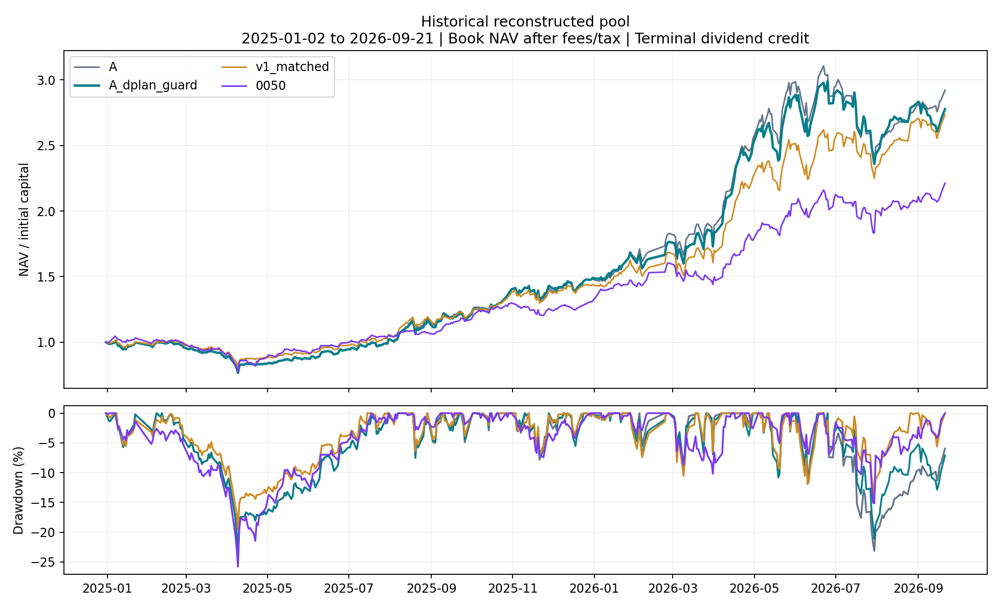
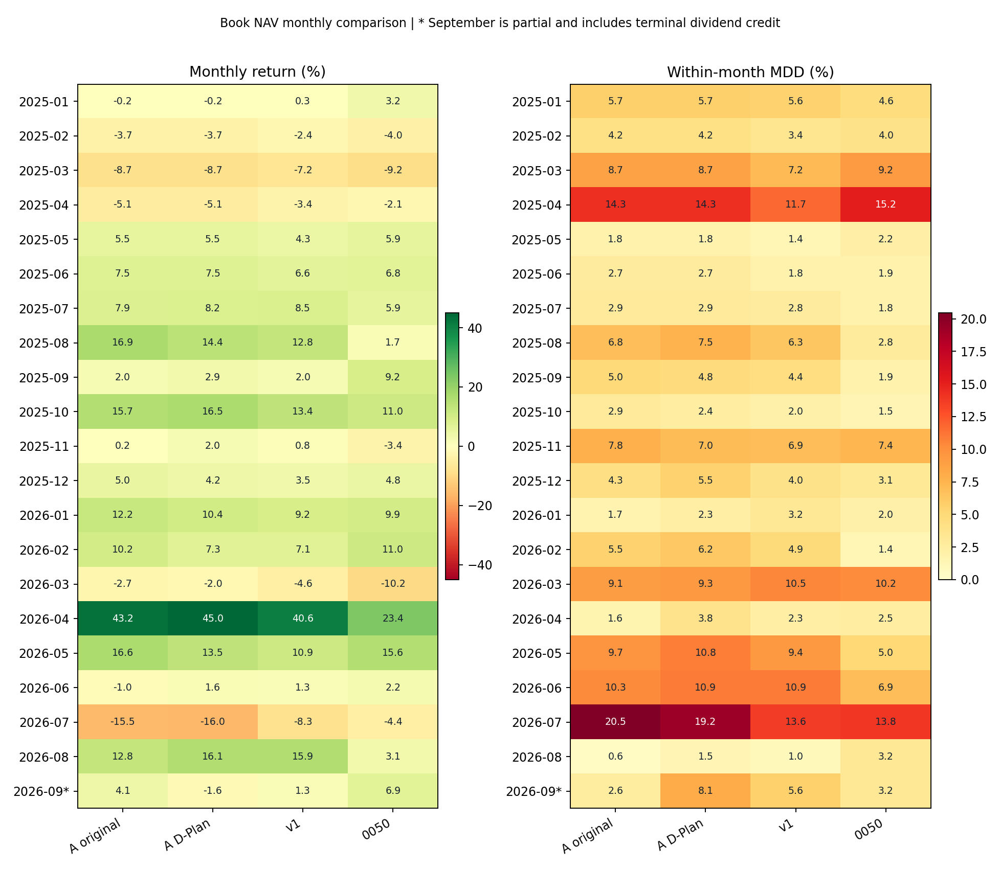
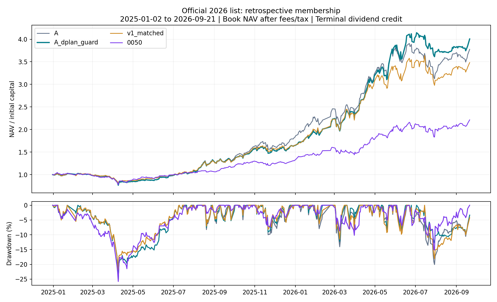
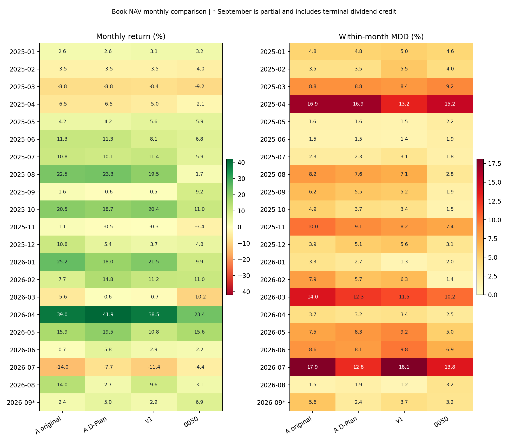

# v2 A｜官方文件完整複核與回測

**十份官方文件已逐一核對；固定 A 與公式相容版均已完整重跑。正式提交仍為 BLOCK，不能把本報告當成已通過比賽所有規則的成績。**

期間為 2025-01-02 至 2026-09-21，共 417 個完整交易日，初始本金 10 億元。1 月 1 日休市；9 月 22 日執行時尚未收盤，因此不用當日不完整行情。歷史池 A 固定 p052，官方事後池固定 p049；本輪沒有再選參數，v3 不再使用。

先看三件事：原策略績效可以重現；D-Plan 股數推導需要修正；Active Share 及正式結算接入仍缺證據。詳細操作已整理為 [每日單頁入口](../daily_auto/README.md)。

## 結論先看

| 項目 | 結果 |
|---|---|
| 原 A 重播 | 兩軌的 NAV、持股、成交、委託均與凍結結果完全相同 |
| 公式相容版 | 只處理權重序列化與零股異動，不改動能參數 |
| 帳務與時序 | 兩軌獨立稽核、實體截斷重播通過 |
| 正式送件 | 尚未放行：AS、公司事件細則及平台帳本／收件仍需接通 |
| v3 | 退出现行流程；原程式與結果保留 |

## 這次改正什麼

官方要求先從目標權重算出整張目標股數，再減掉前日實際庫存。舊程式先決定股數、再反算位於取整邊界的權重，浮點序列化可能少算一張；配股後若有零股，整張目標減現有庫存也無法變成千股倍數。

`A_dplan_guard` 將權重放在同一整張區間內，再精確回算股數。含零股的既有股票先續抱，不對該股下無法符合字面公式的委託；其他股票繼續運作。這是保守的相容性假設，主辦方尚未提供零股和除權日待執行委託的完整細則。

指南和 schema 要求公式一致，反例註解卻說部分不一致僅警示，因此以下只能量化「不符合字面公式」，不能把每列都算成主辦方拒件或一般違規。

| 股票池 | 版本 | 計畫列數 | Decimal 不符 | float 不符 | 涉及零股列 |
| --- | --- | --- | --- | --- | --- |
| 歷史池 | 原 A 固定版 | 1568 | 766 | 298 | 222 |
| 歷史池 | A 公式相容版 | 1461 | 0 | 0 | 0 |
| 官方事後池 | 原 A 固定版 | 1609 | 693 | 187 | 117 |
| 官方事後池 | A 公式相容版 | 1501 | 0 | 0 | 0 |

Decimal 按序列化後十進位數字嚴格回算；float 則模擬一般浮點向下取整。兩者差異證明邊界編碼不穩定，官方伺服器數值實作尚未公布；不能挑其中一個數字當作已知拒件數。

列數包含研究終點後尚未執行的最後計畫；不是主辦方警告次數。舊版凍結檔案未覆寫，修正版本另存，以便核對變動。

## 績效比較

**本輪主表改用比賽帳面 NAV。** 股息先列應收，到模擬期末才入現金；economic NAV 在除息時就加應收，另列回撤供核對。兩者最終報酬一致，途中曲線與月報酬可能不同。

### 歷史股票池

使用重建的 2024 年底股票池；部分股票不在 2026 年官方名單，因此此軌不符合正式比賽白名單。

| 版本 | 總報酬 | NAV 最大回撤 | 含應收回撤 | 交易日 | 成交筆數 | 雙向換手 | 量測硬超限日 | 計畫不可行日 |
| --- | --- | --- | --- | --- | --- | --- | --- | --- |
| 原 A 固定版 | 192.21% | 23.70% | 23.67% | 415/417 | 1566 | 25.15× | 0 | 2 |
| A 公式相容版 | 177.78% | 23.70% | 23.67% | 394/417 | 1452 | 25.76× | 0 | 22 |
| v1 同口徑 | 173.54% | 19.55% | 19.53% | 393/417 | 4340 | 34.20× | 9 | 19 |
| 0050 費後買持 | 121.28% | 25.79% | 24.59% | 1/417 | 1 | 0.90× | 不適用¹ | 5 |





| 版本 | 持股檔數 | 現金比範圍 | 累計費稅／百萬元 | 期末股息入帳／百萬元 |
| --- | --- | --- | --- | --- |
| 原 A 固定版 | 20–30 | 1.14%–20.87% | 111.82 | 67.55 |
| A 公式相容版 | 20–30 | 0.95%–20.67% | 115.26 | 77.15 |

<details markdown="1">
<summary>展開 21 個月明細：報酬 / 月內最大回撤</summary>

| 月份 | 原 A 固定版 | A 公式相容版 | v1 同口徑 | 0050 費後買持 |
| --- | --- | --- | --- | --- |
| 2025-01 | -0.19% / 5.70% | -0.19% / 5.70% | 0.31% / 5.57% | 3.21% / 4.56% |
| 2025-02 | -3.67% / 4.21% | -3.67% / 4.21% | -2.42% / 3.44% | -3.95% / 3.95% |
| 2025-03 | -8.69% / 8.69% | -8.69% / 8.69% | -7.17% / 7.17% | -9.24% / 9.24% |
| 2025-04 | -5.09% / 14.28% | -5.09% / 14.28% | -3.38% / 11.71% | -2.14% / 15.23% |
| 2025-05 | 5.48% / 1.84% | 5.48% / 1.84% | 4.27% / 1.39% | 5.87% / 2.22% |
| 2025-06 | 7.46% / 2.74% | 7.46% / 2.74% | 6.56% / 1.79% | 6.81% / 1.92% |
| 2025-07 | 7.94% / 2.92% | 8.21% / 2.92% | 8.47% / 2.76% | 5.94% / 1.78% |
| 2025-08 | 16.95% / 6.80% | 14.40% / 7.53% | 12.76% / 6.31% | 1.67% / 2.81% |
| 2025-09 | 1.98% / 4.99% | 2.92% / 4.78% | 2.02% / 4.41% | 9.17% / 1.88% |
| 2025-10 | 15.69% / 2.89% | 16.54% / 2.42% | 13.39% / 2.01% | 11.01% / 1.49% |
| 2025-11 | 0.21% / 7.81% | 2.00% / 7.02% | 0.84% / 6.91% | -3.43% / 7.42% |
| 2025-12 | 5.04% / 4.26% | 4.19% / 5.53% | 3.51% / 3.97% | 4.80% / 3.10% |
| 2026-01 | 12.17% / 1.68% | 10.35% / 2.32% | 9.24% / 3.20% | 9.87% / 2.01% |
| 2026-02 | 10.18% / 5.53% | 7.34% / 6.21% | 7.07% / 4.87% | 10.97% / 1.41% |
| 2026-03 | -2.70% / 9.08% | -1.97% / 9.34% | -4.56% / 10.51% | -10.18% / 10.18% |
| 2026-04 | 43.20% / 1.61% | 45.01% / 3.81% | 40.63% / 2.34% | 23.37% / 2.54% |
| 2026-05 | 16.56% / 9.71% | 13.52% / 10.80% | 10.94% / 9.39% | 15.55% / 5.05% |
| 2026-06 | -0.96% / 10.27% | 1.62% / 10.91% | 1.35% / 10.88% | 2.17% / 6.91% |
| 2026-07 | -15.48% / 20.45% | -16.00% / 19.20% | -8.35% / 13.62% | -4.38% / 13.82% |
| 2026-08 | 12.82% / 0.57% | 16.12% / 1.50% | 15.88% / 1.02% | 3.14% / 3.21% |
| 2026-09＊ | 4.10% / 2.62% | -1.61% / 8.06% | 1.32% / 5.62% | 6.93% / 3.17% |

</details>

### 官方名單事後情境

**此軌把 2026 年公布的 150 檔名單套回 2025 年，含成分股前視偏誤。** 它可以檢查指定名單的模擬路徑，不能解讀成當年可事前部署的報酬。

| 版本 | 總報酬 | NAV 最大回撤 | 含應收回撤 | 交易日 | 成交筆數 | 雙向換手 | 量測硬超限日 | 計畫不可行日 |
| --- | --- | --- | --- | --- | --- | --- | --- | --- |
| 原 A 固定版 | 277.51% | 25.39% | 25.36% | 359/417 | 1606 | 24.77× | 0 | 49 |
| A 公式相容版 | 300.59% | 25.39% | 25.36% | 365/417 | 1501 | 23.93× | 0 | 38 |
| v1 同口徑 | 248.15% | 21.81% | 21.80% | 405/417 | 4776 | 36.07× | 7 | 11 |
| 0050 費後買持 | 121.28% | 25.79% | 24.59% | 1/417 | 1 | 0.90× | 不適用¹ | 5 |





| 版本 | 持股檔數 | 現金比範圍 | 累計費稅／百萬元 | 期末股息入帳／百萬元 |
| --- | --- | --- | --- | --- |
| 原 A 固定版 | 20–30 | 1.19%–23.05% | 141.09 | 83.18 |
| A 公式相容版 | 20–30 | 1.19%–23.05% | 131.87 | 105.01 |

<details markdown="1">
<summary>展開 21 個月明細：報酬 / 月內最大回撤</summary>

| 月份 | 原 A 固定版 | A 公式相容版 | v1 同口徑 | 0050 費後買持 |
| --- | --- | --- | --- | --- |
| 2025-01 | 2.59% / 4.77% | 2.59% / 4.77% | 3.10% / 5.01% | 3.21% / 4.56% |
| 2025-02 | -3.54% / 3.54% | -3.54% / 3.54% | -3.47% / 5.49% | -3.95% / 3.95% |
| 2025-03 | -8.78% / 8.80% | -8.78% / 8.80% | -8.40% / 8.40% | -9.24% / 9.24% |
| 2025-04 | -6.49% / 16.94% | -6.49% / 16.94% | -5.04% / 13.23% | -2.14% / 15.23% |
| 2025-05 | 4.23% / 1.60% | 4.23% / 1.60% | 5.65% / 1.51% | 5.87% / 2.22% |
| 2025-06 | 11.30% / 1.55% | 11.30% / 1.55% | 8.10% / 1.41% | 6.81% / 1.92% |
| 2025-07 | 10.77% / 2.33% | 10.08% / 2.33% | 11.37% / 3.07% | 5.94% / 1.78% |
| 2025-08 | 22.49% / 8.24% | 23.25% / 7.55% | 19.52% / 7.06% | 1.67% / 2.81% |
| 2025-09 | 1.60% / 6.18% | -0.58% / 5.54% | 0.46% / 5.23% | 9.17% / 1.88% |
| 2025-10 | 20.51% / 4.94% | 18.71% / 3.73% | 20.44% / 3.41% | 11.01% / 1.49% |
| 2025-11 | 1.14% / 9.97% | -0.54% / 9.07% | -0.31% / 8.17% | -3.43% / 7.42% |
| 2025-12 | 10.78% / 3.95% | 5.43% / 5.09% | 3.72% / 5.55% | 4.80% / 3.10% |
| 2026-01 | 25.15% / 3.26% | 18.04% / 2.66% | 21.45% / 1.30% | 9.87% / 2.01% |
| 2026-02 | 7.74% / 7.93% | 14.81% / 5.74% | 11.19% / 6.26% | 10.97% / 1.41% |
| 2026-03 | -5.65% / 14.04% | 0.60% / 12.27% | -0.73% / 11.47% | -10.18% / 10.18% |
| 2026-04 | 38.96% / 3.67% | 41.94% / 3.23% | 38.49% / 3.42% | 23.37% / 2.54% |
| 2026-05 | 15.91% / 7.49% | 19.47% / 8.35% | 10.82% / 9.24% | 15.55% / 5.05% |
| 2026-06 | 0.72% / 8.56% | 5.83% / 8.07% | 2.93% / 9.83% | 2.17% / 6.91% |
| 2026-07 | -14.02% / 17.90% | -7.68% / 12.81% | -11.42% / 18.08% | -4.38% / 13.82% |
| 2026-08 | 13.98% / 1.52% | 2.75% / 1.90% | 9.56% / 1.19% | 3.14% / 3.21% |
| 2026-09＊ | 2.37% / 5.64% | 4.97% / 2.43% | 2.88% / 3.68% | 6.93% / 3.17% |

</details>

「計畫不可行日」是前日規劃器明確以 INFEASIBLE 開頭、在該日未能產生調整的天數。組合可能因續抱仍未超限，但不代表每日運行順暢；此數與正式漏繳／警告不同，也不含所有名稱為 WAIT 的等待狀態。

¹ 0050 是單一 ETF 比較基準，不套用競賽 20–30 檔及股票白名單。它使用凍結的一次買入、費用與價格預算緩衝，因此不是 100% 滿倉的 0050 官方總報酬指數。

＊2026 年 9 月只到 9/21，且將整段模擬累積股息一次入帳。這會提高最後月份帳面報酬，不代表 9 月突然產生相同幅度的選股優勢。月內 MDD 以「前月末 NAV＋當月每日 NAV」計算。

v1 的硬性超限使它不具合規候選資格。本報告沒有模擬違規日交易回退、三次警告淘汰或 Active Share 失格，因此長期 shadow NAV 不能當作這些情況下的正式排名結果。

## 能與不能證明的事

相容版歷史報酬較原 A 低，官方事後池則較高；這說明零股處理會改變持倉路徑，不能當成一次修正就普遍提升績效。兩軌零量測硬超限只涵蓋各自股票池、檔數、現金及主被動權重限制；尚未包含完整官方 AS 與送件歷史。

前日完整訊號決定固定股數，下一交易日才用官方成交均價記帳；獨立截斷回放檢查未讀取未來行情。這不能消除先前用整段歷史挑參數的開發偏誤，也不能消除官方股票池事後選取的偏誤。

原 A 並不是最早構想的低換手版本：歷史參數允許零分差替換，4H 只驗覆蓋，現金／權重修正仍可能頻繁加减碼。不要把「保留股不全面重配」寫成「幾乎不交易」。

另有公司事件語意未能認證：歷史池相容版在 2025-07-21 計畫出清玉山金 1,146,000 股，翌日先配股 1% 再按固定委託賣出，仍留下 11,460 股。前日公式可以通過，但除權日是否調整待執行委託、SELL_ALL 如何認定，文件未說明。本輪保留事件與餘額，不宣稱所有 D-Plan 語意已符合。

官方假設全額均價成交，因此本輪不因成交量容量刪單。超過日量的模擬成交只能另作實盤限制，不影響本次競賽假設；缺均價仍不能憑空補成交。

## 正式比賽仍缺什麼

| 缺項 | 目前處理 |
| --- | --- |
| 30 檔 ETF 的歷史／每日前十大權重 | UNKNOWN；沒有用現在持股回填過去 |
| AS 聯集、正規化與日期細節 | 等待可驗證的官方口徑；不能僅憑程式算出數字就認證 |
| 零股與除權日委託細則 | 本輪採凍結零股名稱、固定待執行股數的明示假設 |
| 官方帳本與平台回執 | 尚未接通；禁止將本機產檔標成已送件 |
| 真正未見期間 | 未提供；所有本輪歷史已參與研究開發 |

## 官方文件與每日操作

已讀完 10 份檔案，包括 5 份 PDF、官方 DOCX 模板、D-Plan 指南、schema 與正反 JSON 範例。原文、頁碼、衝突及不適用假設見 [逐檔稽核](../docs/official_docs_rule_audit.md)。ETF 名單只列基金代碼，沒有持股權重。

證交所亦說明主動式 ETF 每日揭露持股，但這不等於本機已取得完整的歷史時間版本；[TWSE 說明](https://www.twse.com.tw/zh/ETFortune/hotetf/8a8216d697fc438f0198cfce647b0359) 與 [野村每日 PCF](https://www.nomurafunds.com.tw/ETFWEB/pcf) 僅是後續資料接入的第一手來源。

[每日入口](../daily_auto/README.md) · [比賽須知](../daily_auto/competition_guide.md) · [操作清單](../daily_auto/daily_checklist.md) · [自動化範圍](../daily_auto/automation.md)

## 重現與證據

```bash
python3 scripts/run_official_v2.py --output outputs/official_v2_reproduction
python3 scripts/audit_official_v2.py --output outputs/official_v2_reproduction/historical_pit
python3 scripts/audit_official_v2.py --output outputs/official_v2_reproduction/official_ex_post
```

執行器拒絕覆寫已有結果；獨立稽核綁定程式、資料、設定和完整輸出雜湊。原 `v2_A_best.py` 不變，公式相容版由 `src/official_v2_review.py` 的隔離介面執行。

[歷史池稽核](../outputs/official_v2_reaudit/historical_pit/audit.json) · [官方事後池稽核](../outputs/official_v2_reaudit/official_ex_post/audit.json) · [事前研究規格](../docs/official_v2_protocol.md)

[比較總表](official_v2_reaudit_assets/comparison.csv) · [全部月表](official_v2_reaudit_assets/monthly.csv)
