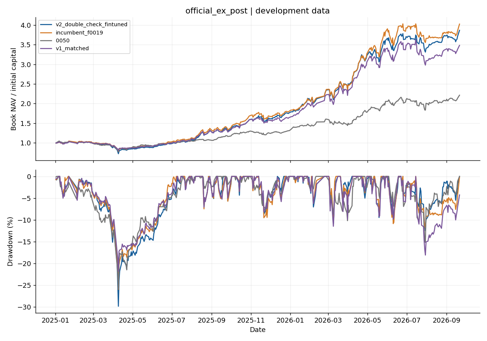
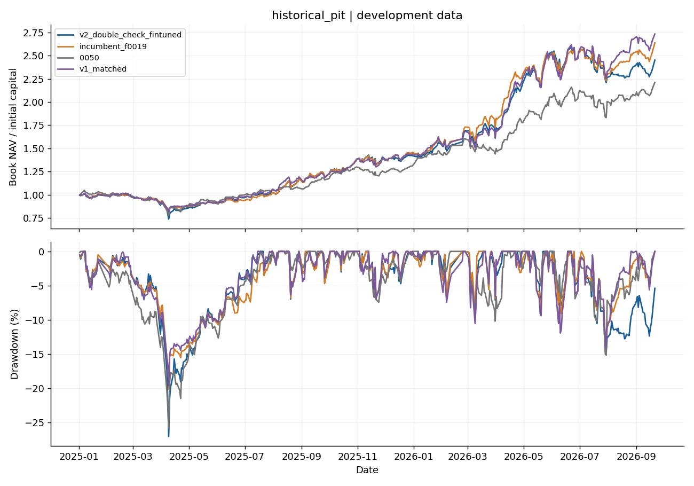
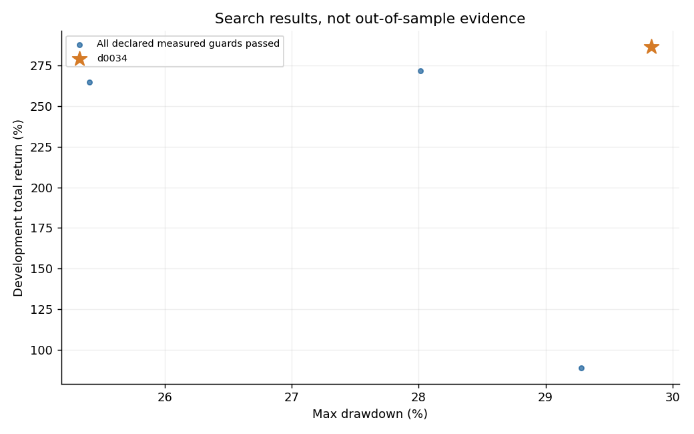
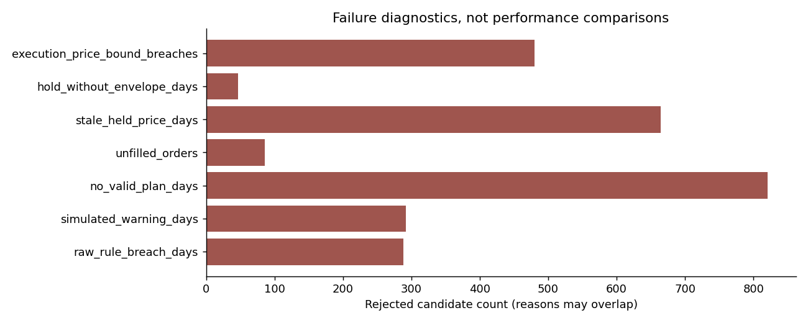
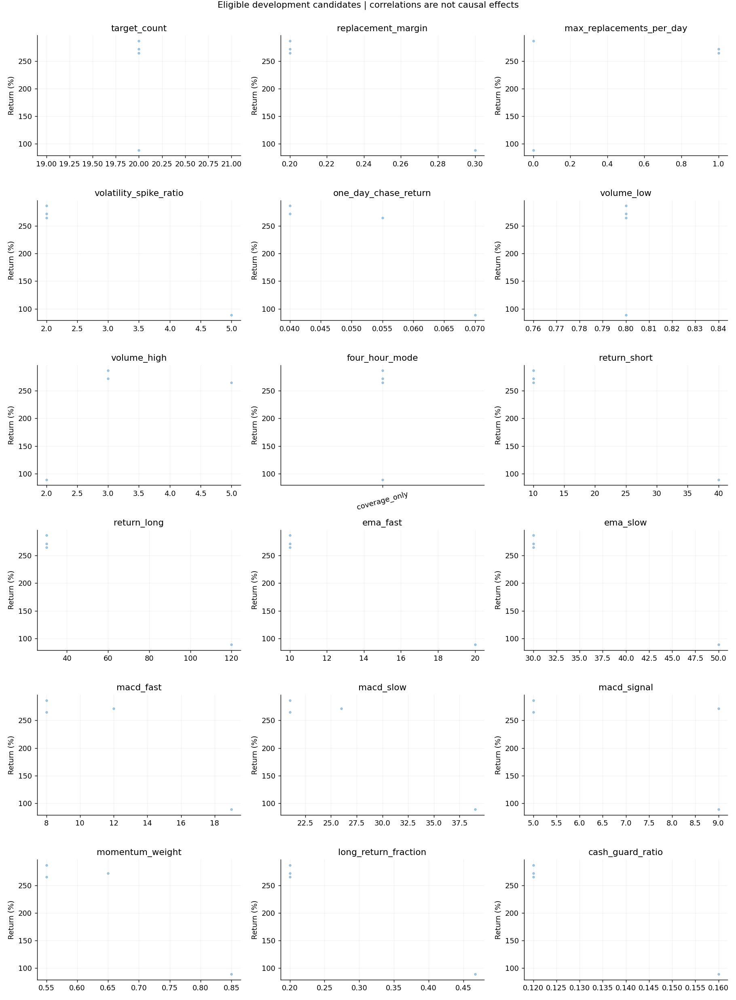

# v2_double_check_fintuned：雙重核對結果

**研究回測已完成；正式 policy 使用仍阻擋。** 已知每日交易限制與保護條件必須全部通過，任何違規、失格、缺價、未成交或保護失效候選都不能獲選。Active Share、官方帳本與平台接受證據不足，因此研究 PASS 不代表符合全部官方規則，也不授權送件。

本輪選擇 `d0034`。資料涵蓋 2025-01-02～2026-09-21，共 417 個交易日；整段行情已參與開發。以下報酬是事後選參績效，沒有未見驗證，也不保證未來零違規。

## 績效比較

| 股票池 | 策略 | 淨報酬 | 最大回撤 |
|---|---|---:|---:|
| official_ex_post | v2_double_check_fintuned | 286.50% | 29.83% |
| historical_pit | v2_double_check_fintuned | 145.35% | 27.02% |
| official_ex_post | incumbent_f0019 | 302.35% | 25.95% |
| official_ex_post | v1_matched | 248.15% | 21.81% |
| official_ex_post | 0050 | 121.28% | 25.79% |
| historical_pit | incumbent_f0019 | 163.94% | 20.10% |
| historical_pit | v1_matched | 173.54% | 19.55% |
| historical_pit | 0050 | 121.28% | 25.79% |
| official_ex_post | incumbent_replayed_new_ledger | 302.35% | 25.95% |
| historical_pit | incumbent_replayed_new_ledger | 163.94% | 20.10% |

新策略在官方事後股票池選參，再用相同參數重播歷史股票池。2026 年公布的官方名單用於 2025 年會造成成分股前視偏誤；歷史池只是敏感度分析，不能當獨立測試。舊版、v1 與 0050 數字來自凍結且經驗證的原報告；它們未獲得本輪相同搜尋預算，所以此表是工程比較，不支持模型優越性的科學結論。`incumbent_replayed_new_ledger` 則是舊 f0019 參數在新帳本下的本輪實際回放。舊參數報酬較高，但官方池出現一次成交價格保護超界，因此不符合本輪嚴格門檻；本版不為保留高報酬放寬條件。

0050 是單一 ETF 情境對照，不符合本競賽的 150 個股白名單與 20–30 檔持股要求。所有舊版對照均未因此取得新版資格，也不參與正式 policy 發布。

模擬按文件所述均價成交，未加入滑價或市場衝擊。official_ex_post 有 10 筆成交超過該股票當日總成交量；historical_pit 有 30 筆成交超過該股票當日總成交量。文件未明訂成交量上限，因此這不是已判定的官方違規；但這些報酬不能視為真實市場可成交績效。





## 每日合規與使用資格

逐日稽核重新計算股數、現金、費稅、成交均價、公司行動、股利、NAV、警告及回退。普通違規同日只記一次，撤銷整日成交與費稅；第三次警告停止。被動權重超限依五日寬限／第六日警告檢查。公司行動保留與期末股利時點仍是明列的研究解釋，不能冒充主辦方確認。

官方仍有五日被動超限寬限；本版選參額外要求全期零超限，避免依賴寬限與未確認歸因。首輪產物因帳務歸因問題隔離，修正後重新執行，未混入結果。

| 股票池 | 原始超限日 | 警告日 | 未成交 | 缺價日 | 保護失效 | 研究候選合格 |
|---|---:|---:|---:|---:|---:|---|
| official_ex_post | 0 | 0 | 0 | 0 | 0 | True |
| historical_pit | 0 | 0 | 0 | 0 | 0 | True |

歷史敏感度池若不合格，會保留原樣揭露；它不能取得正式 policy 使用資格。正式入口 `plan` 不輸出可提交 D-Plan；`research-plan` 只輸出包裝過、標明 `NEVER_SUBMIT` 的研究草稿。阻擋送件也不是成功提交，仍可能無法滿足至少 22 日成功繳交門檻。

完整規則與未知項目見[逐條規則表](../docs/v2_double_check_rules.md)，實驗條件見[本輪 protocol](../docs/v2_double_check_protocol.md)。

## 搜尋實際覆蓋

完成 **836 組唯一候選 × 2 池 = 1672 次回放**，每次都通過獨立帳務驗證。第一階段 714 組，另新增 122 組局部候選；局部網格 128 個原始組合全部覆蓋，與前階段重複者按相同有效參數重用。

通過全部已量測候選門檻的數量：historical_pit 115／836 組；official_ex_post 4／836 組。

完整離散範圍有 **36,303,120,000 組**；本輪沒有全域窮舉，更沒有窮舉無限多連續參數。廣域搜尋涵蓋所有已宣告參數軸，各值逐軸測試加配對 Sobol 取樣；只有明列的七軸、每軸兩值局部網格可稱為完整搜尋。







## 固定參數

| 參數 | 值 |
|---|---|
| `target_count` | `20` |
| `replacement_margin` | `0.2` |
| `max_replacements_per_day` | `0` |
| `volatility_spike_ratio` | `2.0` |
| `one_day_chase_return` | `0.04` |
| `volume_low` | `0.8` |
| `volume_high` | `3.0` |
| `four_hour_mode` | `coverage_only` |
| `return_short` | `10` |
| `return_long` | `30` |
| `ema_fast` | `10` |
| `ema_slow` | `30` |
| `macd_fast` | `8` |
| `macd_slow` | `21` |
| `macd_signal` | `5` |
| `momentum_weight` | `0.55` |
| `long_return_fraction` | `0.19999999999999998` |
| `cash_guard_ratio` | `0.12` |

獲選值位於宣告範圍邊界的軸：`target_count`、`max_replacements_per_day`、`momentum_weight`、`four_hour_mode`。這些邊界尚未證明是全域最佳；本輪停在預先宣告預算，不追逐已見行情無限擴搜。

## 驗證與重現

完整測試 **263 項通過**。兩池獲選參數亦通過移除未來資料與改動未來價格、量能、股利及分割的前綴檢查；既有委託與結算不變。這是因果時序驗證，不是未見行情績效驗證。

```bash
.venv/bin/python v2_double_check_fintuned.py --verify-release
.venv/bin/python v2_double_check_fintuned.py --show-config
.venv/bin/python v2_double_check_fintuned.py --output outputs/double_check_replay
.venv/bin/python -m unittest discover -s tests
```

證據位於 [`outputs/v2_double_check_fintuned`](../outputs/v2_double_check_fintuned/)。`manifest.json` 保存程式／資料 SHA256、Git 起點、環境與搜尋規格；`trials.csv` 保存每組結果；`local_grid.json` 列明全部局部組合；`study_audit.json` 保存帳務核對；`audit.json` 綁定可發行檔案。完整中間帳本保留本機，Git 保留獲選帳本與完整彙總，重跑可重建全部候選。

本輪學到：帳務回退補齊了舊版缺漏，但不能把缺失的官方契約變成 PASS。較高回測報酬也不能證明未來可用；正式使用的決策維持 **HOLD／BLOCK_SUBMISSION**。
