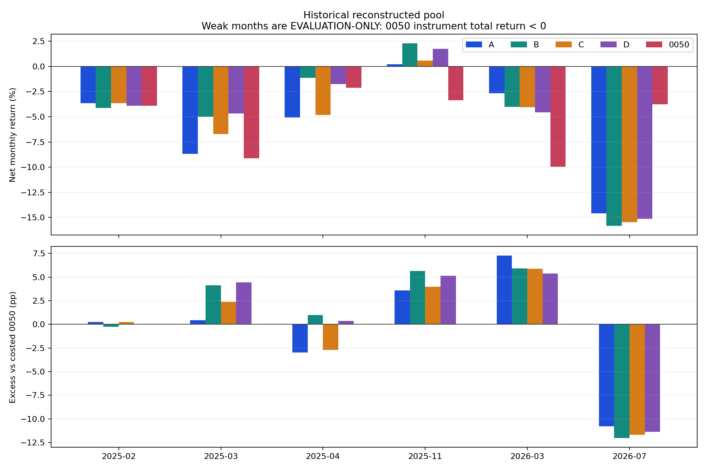
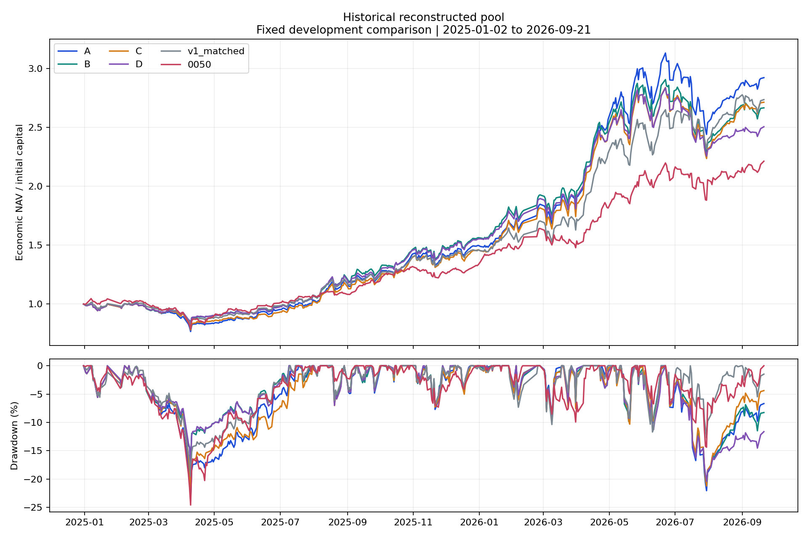
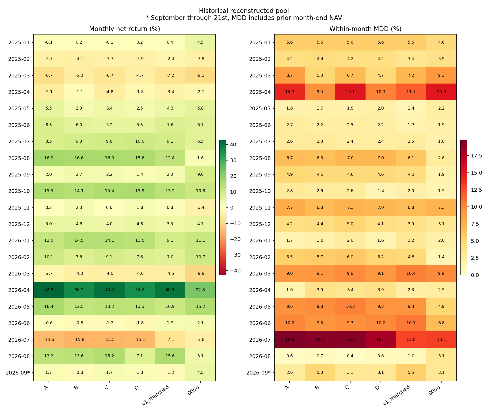
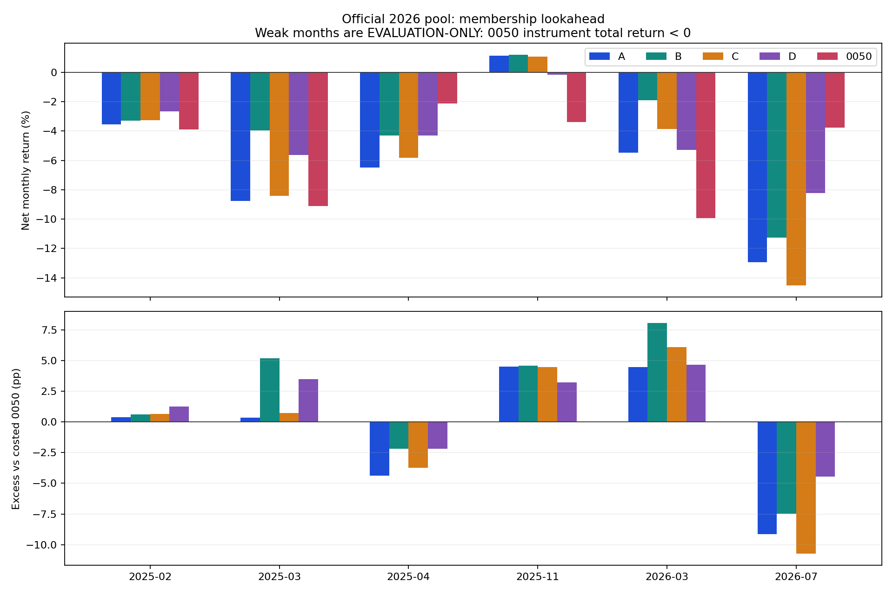
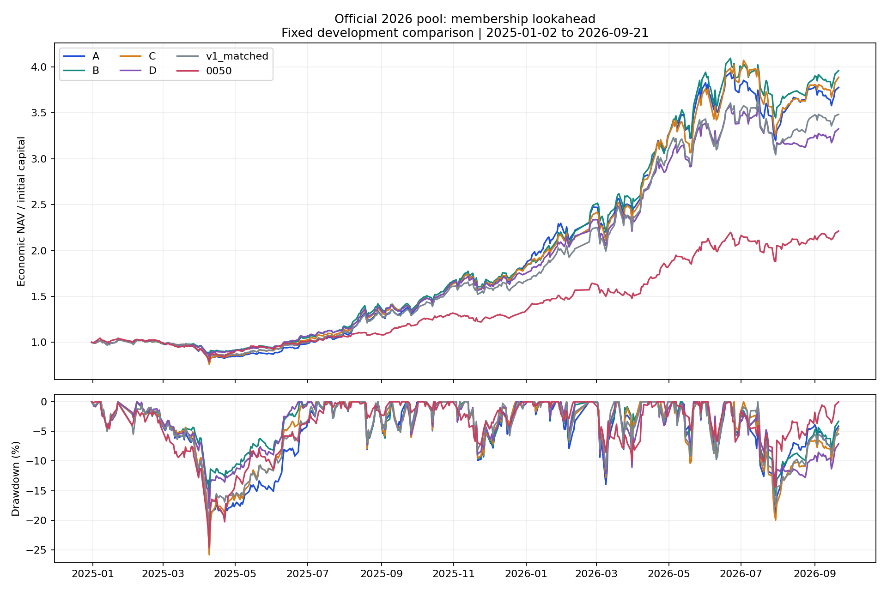
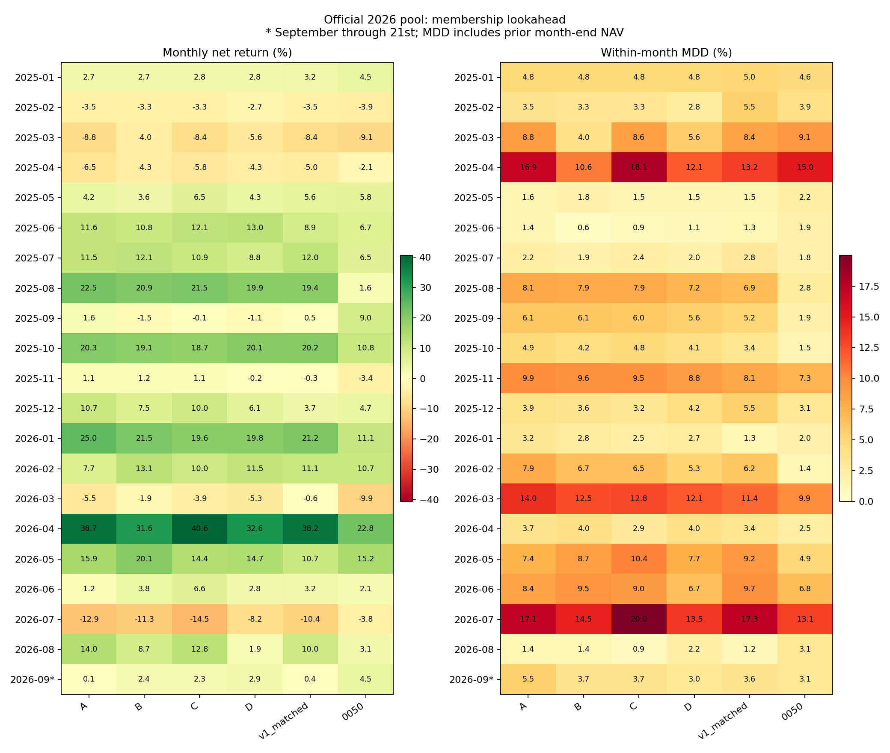

# v3｜弱市選股實驗結果

核心結果：歷史池 B／C／D 都沒有增加逆勢正報酬月份，仍與 A 一樣只有 1／6 個弱月賺錢。部分版本較少跌，不能因此宣稱已解決「弱市找到逆勢上漲公司」的問題。

本輪完成 A／B／C／D 四組固定策略，兩個股票池分開回放，沒有事後挑每月冠軍或自動切換策略。期間為 2025-01-02 至 2026-09-21，共 417 個完整交易日、本金 10 億元。全部金額績效扣除凍結費稅，主表採含應收股息的 economic NAV。

A 凍結目前公開 `v2_A_best.py` 的 p052／p049，並逐筆重現。上一輪 deep A 的 a0036／a0139 並非本輪 A 對照。B 在事前弱市改用低 Beta／低波動排名，C 用前期回歸模型計算的殘差動能，D 等權融合其百分位；正常市場回到原 A 分數。

「少跌」與「逆勢正報酬」分開判斷。0050 下跌月份是月末才能知道的評估標籤，不能用於決策；交易端只使用前日 0050 校正價格低於 EMA60 且 20 個市場交易日報酬負值的訊號。所有設定在正式回放前凍結，本輪不調參。

缺少可驗證的 Active Share 歷史 ETF 持倉，正式提交仍 UNKNOWN／BLOCK_SUBMISSION。歷史池是重建時點假設，正式名單事後池另含成分股前視；兩者都是已見開發歷史，不是未見樣本外驗證。

[原始規格](../docs/AI_CUP_Trading_Agent_v3.md) · [凍結實驗規格](../docs/v3_protocol.md) · [完整設定](../config/v3_weak_market.json) · [方法與文獻檢查](../docs/v3_methodology_review.md)

## 歷史股票池

符合預先定義開發目標：B、C、D。仍維持 HOLD，沒有自動升級為正式交易。

這個開發門檻要求弱月平均改善、勝月與正報酬月數不減少、全期回撤不增加及零已量測硬違規；它屬「少跌」篩查，不要求正報酬月數增加。是否真正增加逆勢賺錢月份，必須另讀下表。

| 版本 | 費後報酬 | 最大回撤 | 硬違規日 | 費稅百萬 | 雙向換手 |
| --- | --- | --- | --- | --- | --- |
| A 原策略 | 192.21% | 23.67% | 0 | 111.82 | 25.15× |
| B 低 Beta／波動 | 166.57% | 21.08% | 0 | 109.41 | 24.65× |
| C 殘差動能 | 171.34% | 22.30% | 0 | 100.01 | 23.80× |
| D 等權融合 | 150.54% | 20.43% | 0 | 105.03 | 24.42× |
| v1 同口徑 | 173.54% | 19.53% | 9 | 152.18 | 34.20× |
| 0050 費後買持 | 121.28% | 24.59% | 不適用 | 1.28 | 0.90× |

本輪依比賽情境採有均價時全額撮合，市場容量不作資格門檻。此軌 B 最大單筆股數為當日成交量的 5037.40%；這是實盤容量限制，不能把此模擬解讀為 10 億元可按相同价格實際成交。

本軌共有 6 個弱月。下表每個平均值均以這些月份等權計算；勝月是相對同口徑費後 0050 買持帳本，正報酬月要求策略自身報酬大於 0。兩者不能互換。

| 版本 | 弱月均報酬 | 弱月超額0050 | 弱月相對A | 勝0050月數 | 正報酬月數 | 強月相對A |
| --- | --- | --- | --- | --- | --- | --- |
| A 原策略 | -5.75% | -0.37 | +0.00 | 4/6 | 1/6 | +0.00 |
| B 低 Beta／波動 | -4.63% | +0.74 | +1.11 | 4/6 | 1/6 | -1.24 |
| C 殘差動能 | -5.69% | -0.32 | +0.06 | 4/6 | 1/6 | -0.58 |
| D 等權融合 | -4.71% | +0.66 | +1.03 | 5/6 | 1/6 | -1.68 |
| v1 同口徑 | -3.96% | +1.42 | +1.79 | 4/6 | 1/6 | -1.40 |
| 0050 費後買持 | -5.37% | +0.00 | +0.37 | 0/6 | 0/6 | -2.54 |

差值單位為百分點。完整 CSV 另列相對 0050 工具總報酬的超額，避免現金預算使基準曝險不足而混淆比較。強月是工具月報酬非負；9 月只計至 21 日。

| 弱月 | A | B | C | D | 0050 |
| --- | --- | --- | --- | --- | --- |
| 2025-02 | -3.67% | -4.14% | -3.67% | -3.90% | -3.91% |
| 2025-03 | -8.68% | -4.98% | -6.73% | -4.67% | -9.12% |
| 2025-04 | -5.09% | -1.13% | -4.81% | -1.76% | -2.11% |
| 2025-11 | 0.20% | 2.29% | 0.58% | 1.75% | -3.38% |
| 2026-03 | -2.67% | -4.02% | -4.05% | -4.56% | -9.94% |
| 2026-07 | -14.58% | -15.81% | -15.47% | -15.14% | -3.78% |

| 弱月 | 事前弱市交易日 | 當月交易日 |
| --- | --- | --- |
| 2025-02 | 1 | 19 |
| 2025-03 | 21 | 21 |
| 2025-04 | 20 | 20 |
| 2025-11 | 0 | 20 |
| 2026-03 | 0 | 22 |
| 2026-07 | 4 | 22 |

上表按訊號的下一個交易日歸屬月份，沒有把月末訊號算成當月已執行。2026-03 雖是事後弱月，當月沒有任何交易日由弱市排名驅動；2026-07 只有 4 日。這顯示本輪的事前狀態與事後弱月並不重合，不能把弱月失利全歸因於個股排名。

| 版本 | 弱月連乘 | 弱月平均月內MDD | 完整強月相對A |
| --- | --- | --- | --- |
| A 原策略 | -30.44% | 10.61% | +0.00 |
| B 低 Beta／波動 | -25.57% | 9.03% | -1.16 |
| C 殘差動能 | -30.22% | 10.41% | -0.63 |
| D 等權融合 | -25.83% | 8.91% | -1.78 |
| v1 同口徑 | -21.71% | 8.71% | -1.30 |
| 0050 費後買持 | -28.42% | 9.73% | -2.92 |

完整強月欄排除 2026-09 部分月份，差值仍為每月平均百分點。弱月連乘是事後挑出不連續月份的條件統計，不能當作可交易淨值曲線；所有交易始終使用各版本完整連續帳本。

| 版本 | 弱市決策日 | 排名介入日 | 候選順序改變 | 有效可進場不足20日 | 缺因子買單 |
| --- | --- | --- | --- | --- | --- |
| A | 51 | 0 | 0 | 0 | 0 |
| B | 51 | 51 | 50 | 16 | 0 |
| C | 51 | 51 | 50 | 16 | 0 |
| D | 51 | 51 | 50 | 16 | 0 |

介入日僅計能在回測期間內執行的訊號。有效可進場不足 20 並不等於違規：策略可能保留既有持股，或因共同最少持股／現金限制使用因子無效股票。這些缺因子買單已明列，不冒稱全部由完整弱市訊號產生。

原 A 的趨勢進場與退出條件完全保留。低 Beta 與正殘差只是不同排名，不能保證絕對上漲；候選仍可能被趨勢門檻擋住。正常日各組分數一致，但先前弱市持倉與交易成本會延續，因此正常市場的 NAV 不必相同。

[總比較](../outputs/v3_weak_market/historical_pit/comparison.csv) · [月表](../outputs/v3_weak_market/historical_pit/monthly_comparison.csv) · [稽核](../outputs/v3_weak_market/historical_pit/audit.json) · [市場狀態](../outputs/v3_weak_market/historical_pit/market_state.csv)

## 正式名單事後情境

此名單於 2026 年才公布，套回 2025 年包含成分股前視，不能視為當時可部署策略。此軌 A 普通換股上限為 0，排名干預只能透過補位與規則修正等渠道影響實際持倉。

符合預先定義開發目標：B。仍維持 HOLD，沒有自動升級為正式交易。

這個開發門檻要求弱月平均改善、勝月與正報酬月數不減少、全期回撤不增加及零已量測硬違規；它屬「少跌」篩查，不要求正報酬月數增加。是否真正增加逆勢賺錢月份，必須另讀下表。

| 版本 | 費後報酬 | 最大回撤 | 硬違規日 | 費稅百萬 | 雙向換手 |
| --- | --- | --- | --- | --- | --- |
| A 原策略 | 277.51% | 25.36% | 0 | 141.09 | 24.77× |
| B 低 Beta／波動 | 295.80% | 16.11% | 0 | 168.37 | 28.52× |
| C 殘差動能 | 288.52% | 25.84% | 0 | 140.08 | 25.01× |
| D 等權融合 | 232.45% | 18.08% | 0 | 147.17 | 27.89× |
| v1 同口徑 | 248.15% | 21.80% | 7 | 195.35 | 36.07× |
| 0050 費後買持 | 121.28% | 24.59% | 不適用 | 1.28 | 0.90× |

本輪依比賽情境採有均價時全額撮合，市場容量不作資格門檻。此軌 D 最大單筆股數為當日成交量的 6109.23%；這是實盤容量限制，不能把此模擬解讀為 10 億元可按相同价格實際成交。

本軌共有 6 個弱月。下表每個平均值均以這些月份等權計算；勝月是相對同口徑費後 0050 買持帳本，正報酬月要求策略自身報酬大於 0。兩者不能互換。

| 版本 | 弱月均報酬 | 弱月超額0050 | 弱月相對A | 勝0050月數 | 正報酬月數 | 強月相對A |
| --- | --- | --- | --- | --- | --- | --- |
| A 原策略 | -6.01% | -0.64 | +0.00 | 4/6 | 1/6 | +0.00 |
| B 低 Beta／波動 | -3.92% | +1.45 | +2.09 | 4/6 | 1/6 | -0.75 |
| C 殘差動能 | -5.80% | -0.43 | +0.21 | 4/6 | 1/6 | +0.06 |
| D 等權融合 | -4.38% | +0.99 | +1.63 | 4/6 | 0/6 | -1.84 |
| v1 同口徑 | -4.70% | +0.67 | +1.31 | 4/6 | 0/6 | -1.29 |
| 0050 費後買持 | -5.37% | +0.00 | +0.64 | 0/6 | 0/6 | -4.56 |

差值單位為百分點。完整 CSV 另列相對 0050 工具總報酬的超額，避免現金預算使基準曝險不足而混淆比較。強月是工具月報酬非負；9 月只計至 21 日。

| 弱月 | A | B | C | D | 0050 |
| --- | --- | --- | --- | --- | --- |
| 2025-02 | -3.53% | -3.30% | -3.27% | -2.65% | -3.91% |
| 2025-03 | -8.77% | -3.96% | -8.41% | -5.63% | -9.12% |
| 2025-04 | -6.48% | -4.29% | -5.83% | -4.29% | -2.11% |
| 2025-11 | 1.13% | 1.20% | 1.08% | -0.17% | -3.38% |
| 2026-03 | -5.48% | -1.90% | -3.85% | -5.29% | -9.94% |
| 2026-07 | -12.93% | -11.28% | -14.51% | -8.23% | -3.78% |

| 弱月 | 事前弱市交易日 | 當月交易日 |
| --- | --- | --- |
| 2025-02 | 1 | 19 |
| 2025-03 | 21 | 21 |
| 2025-04 | 20 | 20 |
| 2025-11 | 0 | 20 |
| 2026-03 | 0 | 22 |
| 2026-07 | 4 | 22 |

上表按訊號的下一個交易日歸屬月份，沒有把月末訊號算成當月已執行。2026-03 雖是事後弱月，當月沒有任何交易日由弱市排名驅動；2026-07 只有 4 日。這顯示本輪的事前狀態與事後弱月並不重合，不能把弱月失利全歸因於個股排名。

| 版本 | 弱月連乘 | 弱月平均月內MDD | 完整強月相對A |
| --- | --- | --- | --- |
| A 原策略 | -31.50% | 11.69% | +0.00 |
| B 低 Beta／波動 | -21.71% | 9.09% | -0.96 |
| C 殘差動能 | -30.69% | 12.06% | -0.09 |
| D 等權融合 | -23.71% | 9.16% | -2.17 |
| v1 同口徑 | -25.43% | 10.65% | -1.40 |
| 0050 費後買持 | -28.42% | 9.73% | -5.20 |

完整強月欄排除 2026-09 部分月份，差值仍為每月平均百分點。弱月連乘是事後挑出不連續月份的條件統計，不能當作可交易淨值曲線；所有交易始終使用各版本完整連續帳本。

| 版本 | 弱市決策日 | 排名介入日 | 候選順序改變 | 有效可進場不足20日 | 缺因子買單 |
| --- | --- | --- | --- | --- | --- |
| A | 51 | 0 | 0 | 0 | 0 |
| B | 51 | 51 | 46 | 19 | 0 |
| C | 51 | 51 | 47 | 19 | 0 |
| D | 51 | 51 | 47 | 19 | 0 |

介入日僅計能在回測期間內執行的訊號。有效可進場不足 20 並不等於違規：策略可能保留既有持股，或因共同最少持股／現金限制使用因子無效股票。這些缺因子買單已明列，不冒稱全部由完整弱市訊號產生。

原 A 的趨勢進場與退出條件完全保留。低 Beta 與正殘差只是不同排名，不能保證絕對上漲；候選仍可能被趨勢門檻擋住。正常日各組分數一致，但先前弱市持倉與交易成本會延續，因此正常市場的 NAV 不必相同。

[總比較](../outputs/v3_weak_market/official_ex_post/comparison.csv) · [月表](../outputs/v3_weak_market/official_ex_post/monthly_comparison.csv) · [稽核](../outputs/v3_weak_market/official_ex_post/audit.json) · [市場狀態](../outputs/v3_weak_market/official_ex_post/market_state.csv)

## 設定與驗證邊界

Beta 與波動率使用 60 筆有效配對日報酬；含截距 OLS 使用當日之前 120 筆有效配對資料，逐日一步預測殘差取最近 20 筆的標準化總和。窗口跨缺漏時可長於相同數量的市場交易日；起訖與觀測數保存在 features.csv。0050 停牌日不補零報酬，未知市場狀態整日回 A。

B／C／D 共用因子完整交集，百分位同分取平均。無效股分數為 0，保留原進出場資格；完整交集少於 20 檔則整日回 A。A 的持股／現金／權重、均價成交、費用及規則修正全部共用，沒有為弱市績效放寬。缺設定拒絕執行，缺認證資料則保持正式阻擋。

獨立稽核核對來源、A 精確重播、原條件保留、弱市排名、帳務與月表。截斷資料重播只證明固定設定的時間一致性，不證明這些設計在 2025 年初已被選定。完整 scope 與截斷日期以各軌 audit.json 為準。

弱月樣本少，且本段歷史已多次用於研究。本輪沒有充分調整 B／C／D 的配套參數，因此只能評價這組預先固定的實作，不能判定所有低風險或殘差動能方法有效或無效。若目標未達成，保留負面證據，不事後修改成功標準。

下一個可採用判斷需要固定版本的新期間資料與完整合規證據。正式提交策略必須在該期間之前指定；本輪不啟用自動選策略。

[完整月表](v3_weak_market_assets/monthly_comparison.csv) · [弱月比較](v3_weak_market_assets/weak_month_summary.csv) · [分組統計](v3_weak_market_assets/conditioned_periods.csv) · [介入明細](v3_weak_market_assets/intervention_detail.csv) · [執行程式](../scripts/run_v3_study.py)

重現命令：`python3 scripts/run_v3_study.py --output outputs/v3_weak_market_reproduction`。程式拒絕覆寫非空結果；稽核後才可生成報告。
